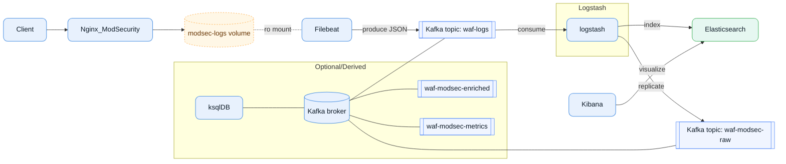

# 🛡️ WAF – Nginx Application Firewall with ModSecurity & OWASP CRS (Not Released)

&#x20;  &#x20;

**Nginx + ModSecurity WAF** powered by the **OWASP ModSecurity Core Rule Set (CRS)**. This repository spins up a full local pipeline with **Filebeat → Kafka → Logstash → Elasticsearch ← Kibana**, plus optional **ksqlDB** for stream processing.

---

## ✨ Highlights

- Production-like local stack built with **Docker Compose**
- **KRaft Kafka (no Zookeeper)** with scripted topic bootstrap
- **Filebeat → Kafka **`` (single source of truth)
- **Logstash fan‑out:**
  - Indexes `waf-logs` to **Elasticsearch**
  - **Replicates** the same event to **Kafka **`` (loop-safe)
- Optional **ksqlDB** to derive `enriched`/`metrics` streams
- **Kibana** dashboards for quick exploration

---

## 📐 Architecture



---

## 🧩 Services (container names / ports)

- **waf-nginx** – Nginx + ModSecurity (HTTP: **8080**) writes **ModSecurity JSON logs** to a Docker volume
- **waf-filebeat** – reads the shared volume and publishes to Kafka topic ``
- **waf-kafka** – Apache Kafka (Confluent **7.6.1**, KRaft mode) (**9092**)
- **topics-init** – runs `kafka/ensure-topics.sh` to create topics idempotently
- **waf-ksqldb** – ksqlDB server (**8088**)
- **ksqldb-cli-init** – runs `ksqldb/ddl.sql` and `ksqldb/rulemap-init.sql` after ksqlDB is healthy
- **waf-logstash** – consumes from Kafka, **indexes to ES**, and **fans out** to Kafka `waf-modsec-raw`
- **waf-es** – Elasticsearch **8.15.2** (**9200**)
- **waf-kibana** – Kibana **8.15.2** (**5601**)

---

## 📦 Kafka Topics

Created by `kafka/ensure-topics.sh` via the `topics-init` service:

- `waf-logs` (Filebeat → Kafka)
- `waf-modsec-raw` (Logstash fan‑out copy of `waf-logs`)
- `waf-rulemap` (compact; for lookups/joins)
- `waf-modsec-enriched` (derived)
- `waf-modsec-metrics` (derived)

> **Note:** Filebeat can’t publish one event to two topics at once. That’s why we fan‑out in **Logstash**.

---

## 🚀 Quickstart

### Prerequisites

- Docker 20+
- Docker Compose v2

### Build & Run

```bash
# Build nginx image (uses local Dockerfile)
docker compose build --no-cache

# Start everything
docker compose up -d
```

### Verify health

```bash
# Kafka topics
docker exec -it waf-kafka \
  kafka-topics --bootstrap-server kafka:9092 --list

# ksqlDB info
curl -fsS http://localhost:8088/info | jq .

# Logstash config test
docker exec -it waf-logstash \
  logstash -t -f /usr/share/logstash/pipeline/pipeline.conf
```

### Generate traffic

```bash
curl -i "http://localhost:8080/test.html?q=<script>alert(1)</script>"
```

- Check **Kibana** at [http://localhost:5601](http://localhost:5601)
- Data should appear in indices: `waf-logs-*`, `waf-modsec-raw-*`, and (if enabled) `waf-modsec-enriched-*`, `waf-modsec-metrics-*`

---

## ⚙️ Configuration

### Nginx + ModSecurity

- Configs sit under `nginx/` (see `nginx/nginx.conf`, `nginx/modsecurity/*`)
- CRS rules are mounted from this repo (`coreruleset/`)

### Filebeat → Kafka

`filebeat/filebeat.yml` parses JSON, extracts a timestamp (`transaction.time_stamp → ts`), remaps a few fields, and publishes **only** to `waf-logs`:

```yaml
output.kafka:
  hosts: ["kafka:9092"]
  topic: "waf-logs"
  compression: gzip
  required_acks: 1
  codec:
    json:
      pretty: false
      escape_html: false
```

### Logstash (fan‑out + indexing)

- Consumes `waf-logs`, `waf-modsec-raw`, `waf-modsec-enriched`, `waf-modsec-metrics`
- **Fan‑out rule:** when consuming ``, Logstash indexes to ES and **also produces the same event** to Kafka topic ``. It does **not** re-publish anything consumed from `waf-modsec-raw` → no loop.
- Optional: set a consistent partitioning key (e.g., `txId`) via `message_key => "%{txId}"` in the Kafka output.

### ksqlDB

- `ksqldb/ddl.sql` should create streams/tables (DDL only recommended)
- `ksqldb/rulemap-init.sql` may seed data (DML). Both are run by `ksqldb-cli-init` after the server is healthy.
- Handy queries:

```sql
SET 'auto.offset.reset'='earliest';
SELECT * FROM RULEMAP EMIT CHANGES LIMIT 100;
SELECT WINDOWSTART, WINDOWEND, * FROM ATTACKS_BY_IP_1M EMIT CHANGES LIMIT 100;
```

---

## 📚 Directory Structure (excerpt)

```
.
├── docker-compose.yml
├── Dockerfile
├── nginx/
│   ├── nginx.conf
│   ├── init.sh
│   ├── html/
│   └── modsecurity/
├── filebeat/
│   └── filebeat.yml
├── logstash/
│   └── pipeline/pipeline.conf
├── kafka/
│   └── ensure-topics.sh
├── ksqldb/
│   ├── ddl.sql
│   └── rulemap-init.sql
├── docs/
│   ├── KAFKA.md
│   ├── KIBANA.md
│   ├── KSQL.md
│   └── NGINX.md
└── TROUBLESHOOTING/
    ├── KSQL_INIT.md
    └── KSQL_JOIN.md
```

---

## 🧪 Testing & Ops Cheatsheet

**Trigger WAF**

```bash
curl -i "http://localhost:8080/?q=<script>alert(1)</script>"
```

**Check Nginx/ModSecurity logs**

```bash
docker logs waf-nginx
Docker exec -it waf-nginx sh -lc 'tail -n 100 /var/log/modsecurity/*.log'
```

**Watch Kafka topics**

```bash
docker exec -it waf-kafka \
  kafka-console-consumer --bootstrap-server kafka:9092 \
  --topic waf-logs --from-beginning --timeout-ms 5000
```

**Kibana**

- [http://localhost:5601](http://localhost:5601)
- Create data views: `waf-logs-*`, `waf-modsec-raw-*`, `waf-modsec-enriched-*`, `waf-modsec-metrics-*`

---

## 🧱 (Optional) Index Template for ES - (Not Implementes)

Lock down important field types to avoid mapping conflicts:

```json
PUT _index_template/waf-template
{
  "index_patterns": [
    "waf-logs-*",
    "waf-modsec-raw-*",
    "waf-modsec-enriched-*",
    "waf-modsec-metrics-*"
  ],
  "template": {
    "settings": { "number_of_shards": 1, "number_of_replicas": 0 },
    "mappings": {
      "dynamic": true,
      "properties": {
        "@timestamp": { "type": "date" },
        "status": { "type": "integer" },
        "anomalyScore": { "type": "integer" },
        "txId": { "type": "keyword" },
        "rule": { "properties": { "id": { "type": "keyword" } } },
        "source": { "properties": { "ip": { "type": "ip" } } },
        "url": {
          "properties": {
            "domain": { "type": "keyword" },
            "path": { "type": "keyword" }
          }
        },
        "event": { "properties": { "category": { "type": "keyword" }, "kind": { "type": "keyword" } } },
        "observer": { "properties": { "type": { "type": "keyword" }, "name": { "type": "keyword" } } },
        "labels": { "properties": { "tenant": { "type": "keyword" } } },
        "message": { "type": "text" }
      }
    }
  },
  "priority": 200
}
```

---

## 🩺 Troubleshooting

- **Logstash config parse errors**: the DSL does **not** support semicolons `;`. Split plugin options by newline/spaces. Test with:
  ```bash
  docker exec -it waf-logstash logstash -t -f /usr/share/logstash/pipeline/pipeline.conf
  ```
- **Filebeat to two topics?** Not supported. Use **Logstash fan‑out** (already configured) or run a second Filebeat instance (not recommended).
- ``** field rename conflicts**: Beats often send `host.*` as an object. If you need `url.domain`, copy from `host.name` instead of renaming the whole `host` object.
- **Time zones & index date**: index suffixes are based on `@timestamp`. In this repo, date filters set `UTC` (you can change if you want KST-based cuts).

---

## 🔒 License & Credits

- MIT License (see `License.md`)
- CRS: [https://github.com/coreruleset/coreruleset](https://github.com/coreruleset/coreruleset)
- ModSecurity: [https://github.com/SpiderLabs/ModSecurity](https://github.com/SpiderLabs/ModSecurity)
- Nikto: [https://github.com/sullo/nikto](https://github.com/sullo/nikto)