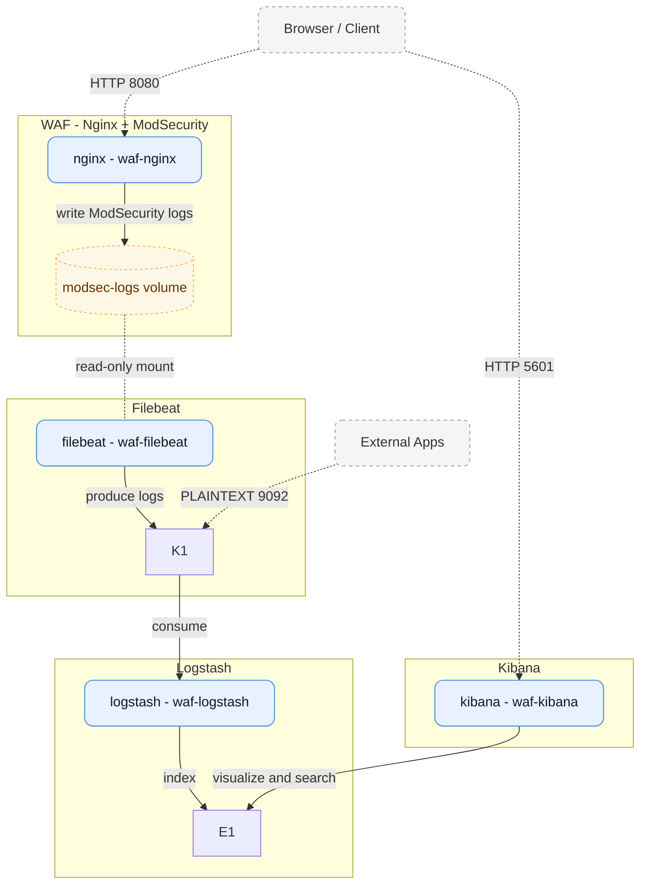
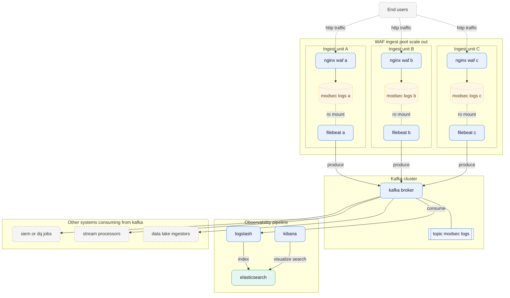
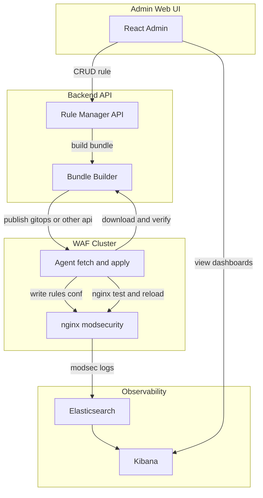

# 🛡️ WAF - Nginx Application Firewall with ModSecurity & OWASP CRS

[](https://www.docker.com/) [](https://nginx.org/) [](https://coreruleset.org/) [](LICENSE) [](https://youtu.be/f_OKEZ0H4FQ)

> **Nginx + ModSecurity WAF** powered by **OWASP ModSecurity Core Rule Set (CRS)** 🚀  
> Test and experiment with a Web Application Firewall locally using Docker.

---

## 📺 Preview
[](https://youtu.be/f_OKEZ0H4FQ)


## Flow Diagram
- Nginx → (modsec-logs volume) → Filebeat → Kafka → Logstash → Elasticsearch ← Kibana



## Expaned Final Flow



---

## Deploy Flow


---

## ⚙️ Components
- **Nginx + ModSecurity**: WebServer with ModSecurity engine
- **OWASP CRS**: Attack detection ruleset ([coreruleset/coreruleset](https://github.com/coreruleset/coreruleset))
- **Docker Compose**: Local setup with a custom Dockerfile based on `owasp/modsecurity:nginx-alpine`

---

## 📂 Directory Structure
```
├── startup.sh
├── Dockerfile
├── docker-compose.yml
├── nginx
│   ├── nginx.conf
│   ├── init.sh
│   ├── html/
│   │   ├── 403.html
│   │   └── 404.html
│   └── modsecurity/
│       ├── modsecurity.conf
│       ├── crs-setup.conf
│       ├── include.conf
│       └── rules/
```

---

## 🚀 How to Run

```bash
docker-compose build --no-cache
docker-compose up
```

---

## 🧪 How to Test
**Request**
```bash
curl -i "http://localhost:8080/?q=<script>alert(1)</script>"
```
**Response**
```http
HTTP/1.1 403 Forbidden
Server: nginx/1.22.1
...
<h1>403 Forbidden</h1>
<p>Access has been blocked. (ModSecurity)</p>
```

---

## 📜 Log Check

```bash
docker logs waf-nginx
docker exec -it waf-nginx cat /var/log/modsecurity/modsec_audit.log
```

---

## 🛠️ Key Configs

**`modsecurity.conf`**

```conf
SecRuleEngine On
SecRequestBodyAccess On
SecResponseBodyAccess Off
SecAuditEngine RelevantOnly
SecAuditLogParts ABIJDEFHZ
SecAuditLog /var/log/modsecurity/modsec_audit.log
Include /etc/modsecurity.d/crs-setup.conf
Include /etc/modsecurity.d/rules/*.conf
```

**`nginx.conf`**

```conf
modsecurity on;
modsecurity_rules_file /etc/modsecurity/modsecurity.conf;
```

**`403 page`**

```nginx
error_page 403 /403.html;

location = /403.html {
    root /usr/share/nginx/html;
    internal;
}
```

---

## 🔍 Rule Examples

| Case         | Rule ID  | Rule File                              |
|--------------|----------|----------------------------------------|
| XSS          | 941100   | REQUEST-941-APPLICATION-ATTACK-XSS     |
| SQL Injection| 942100   | REQUEST-942-APPLICATION-ATTACK-SQLI    |
| LFI          | 930100   | REQUEST-930-APPLICATION-ATTACK-LFI     |

---

## 📚 Reference

- [OWASP CRS GitHub](https://github.com/coreruleset/coreruleset)
- [ModSecurity Reference Manual](https://github.com/SpiderLabs/ModSecurity/wiki)