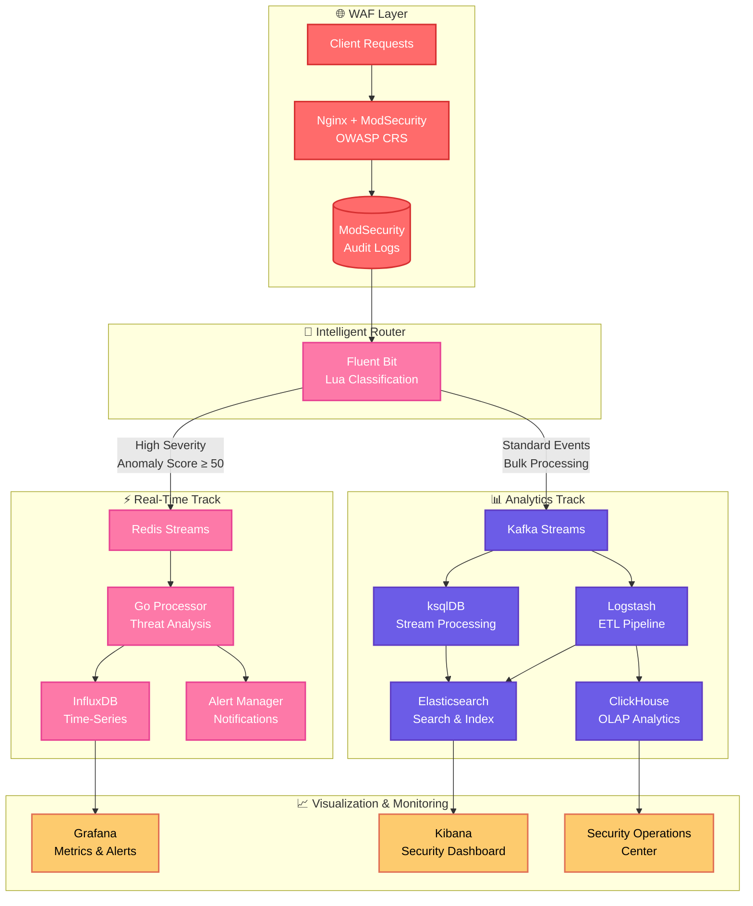

# 🛡️ Enterprise Web Application Firewall (WAF) Platform


**Enterprise-grade Web Application Firewall** powered by **Nginx + ModSecurity + OWASP Core Rule Set (CRS)** with intelligent dual-track log processing, real-time threat detection, and comprehensive security analytics.

## 🌟 Enterprise Features

- **🚀 Real-Time Threat Detection** - Sub-second response to critical security events
- **📊 Dual-Track Architecture** - Separates real-time threats from bulk analytics
- **🔍 Advanced Analytics** - Stream processing with ksqlDB and ClickHouse OLAP
- **⚡ High Performance** - Handles 10,000+ requests/second with horizontal scaling
- **🛡️ Enterprise Security** - RBAC, encryption, audit logging, compliance ready
- **📈 Comprehensive Monitoring** - Grafana dashboards, Prometheus metrics, alerting
- **☁️ Cloud Native** - Kubernetes ready with Helm charts and operators
- **🔧 DevOps Ready** - CI/CD integration, infrastructure as code, GitOps workflow

---

## 📐 Architecture Overview

The WAF platform implements a sophisticated **dual-track architecture** that intelligently routes security events based on threat severity and processing requirements.

### High-Level Architecture



### Dual-Track Processing Strategy

| Track | Purpose | Latency | Use Cases |
|-------|---------|---------|-----------|
| **Real-Time** | Immediate threat response | < 1 second | Critical attacks, active threats, alerting |
| **Analytics** | Historical analysis & compliance | 5-30 seconds | Reporting, forensics, trend analysis |

### Key Components

#### 🛡️ **WAF Layer**
- **Nginx + ModSecurity**: High-performance web application firewall
- **OWASP CRS**: Industry-standard rule set with 200+ security rules
- **JSON Audit Logging**: Structured logs for automated processing

#### ⚡ **Real-Time Processing Track**
- **Fluent Bit + Lua**: Intelligent event classification and routing
- **Redis Streams**: High-throughput message streaming for critical events
- **Go Microservice**: Real-time threat analysis and severity scoring
- **InfluxDB**: Time-series storage for metrics and monitoring
- **Alert Manager**: Multi-channel notification system

#### 📊 **Analytics Processing Track**
- **Apache Kafka**: Distributed streaming platform for bulk event processing
- **ksqlDB**: Stream processing for event enrichment and aggregation
- **Logstash**: ETL pipeline for data transformation and routing
- **Elasticsearch**: Full-text search and indexing for security events
- **ClickHouse**: Column-oriented database for analytical queries

#### 📈 **Monitoring & Visualization**
- **Grafana**: Real-time metrics dashboards and alerting
- **Kibana**: Security event exploration and investigation
- **Custom Dashboards**: Executive reporting and compliance views

---

## 🚀 Quick Start Guide

### Prerequisites

- **Docker Engine 20.10+**
- **Docker Compose v2**
- **8GB RAM minimum** (16GB recommended for production)
- **20GB disk space** for logs and data storage

### Development Environment

```bash
# Clone the repository
git clone https://github.com/company/enterprise-waf
cd enterprise-waf

# Start all services
docker-compose up -d

# Verify deployment
./scripts/health-check.sh
```

### Production Deployment

```bash
# Set environment variables
export INFLUXDB_TOKEN="your-secure-token"
export KAFKA_PASSWORD="your-kafka-password"

# Deploy with production configuration
docker-compose -f docker-compose.prod.yml up -d

# Configure monitoring
./scripts/setup-monitoring.sh
```

### Generate Test Traffic

```bash
# Normal request
curl "http://localhost:8080/"

# Trigger XSS detection (realtime track)
curl "http://localhost:8080/search?q=<script>alert('xss')</script>"

# Trigger SQL injection (realtime track)
curl "http://localhost:8080/login" -d "user=admin' OR 1=1--"

# Scanner simulation (analytics track)
curl "http://localhost:8080" -H "User-Agent: Nikto"
```

---

## 🏗️ Service Architecture

### Core Services

| Service | Container | Port | Purpose | Track |
|---------|-----------|------|---------|-------|
| **WAF** | `waf-nginx` | 8080 | Web Application Firewall | Both |
| **Log Router** | `waf-fluent-bit` | 2020 | Intelligent event classification | Both |
| **Real-time Processor** | `waf-realtime-processor` | - | Threat analysis & alerting | Real-time |
| **Stream Platform** | `waf-kafka` | 9092 | Event streaming | Analytics |
| **Stream Processor** | `waf-ksqldb` | 8088 | Stream enrichment | Analytics |
| **ETL Pipeline** | `waf-logstash` | 5044 | Data transformation | Analytics |

### Storage Services

| Service | Container | Port | Purpose | Data Type |
|---------|-----------|------|---------|-----------|
| **Time-Series DB** | `waf-influxdb` | 8086 | Real-time metrics | Time-series |
| **Search Engine** | `waf-elasticsearch` | 9200 | Security event search | Documents |
| **Analytics DB** | `waf-clickhouse` | 8123 | OLAP queries | Columnar |
| **Cache/Streams** | `waf-redis-streams` | 6380 | Real-time events | Key-Value |
| **Session Store** | `waf-redis` | 6379 | Application state | Key-Value |

### Monitoring & Visualization

| Service | Container | Port | Purpose |
|---------|-----------|------|---------|
| **Security Dashboard** | `waf-kibana` | 5601 | Event analysis & investigation |
| **Metrics Dashboard** | `waf-grafana` | 3000 | Performance & health monitoring |
| **Log Aggregation** | `waf-loki` | 3100 | Centralized logging |

---

## 📊 Data Flow & Topics

### Real-Time Track Flow
```
ModSecurity Logs → Fluent Bit → Redis Streams → Go Processor → InfluxDB → Grafana
                                                           ↓
                                                        Alerts
```

### Analytics Track Flow  
```
ModSecurity Logs → Fluent Bit → Kafka Topics → ksqlDB → Enriched Data
                                     ↓              ↓
                                 Logstash → Elasticsearch → Kibana
                                     ↓
                                ClickHouse → Analytics Dashboard
```

### Kafka Topics

| Topic | Purpose | Retention | Partitions |
|-------|---------|-----------|------------|
| `waf-logs` | Raw security events | 7 days | 6 |
| `waf-modsec-enriched` | Processed events with metadata | 30 days | 6 |
| `waf-modsec-metrics` | Aggregated metrics | 90 days | 3 |
| `waf-rulemap` | Rule definitions (compacted) | ∞ | 1 |

### Redis Streams

| Stream | Purpose | Max Length |
|--------|---------|------------|
| `waf-realtime-events` | High-severity security events | 10,000 |
| `waf-alerts` | Critical alerts for dashboards | 1,000 |

---

## 🔧 Configuration & Tuning

### Environment Variables

#### Core Configuration
```bash
# WAF Configuration
WAF_MODE=detection                    # detection|prevention
WAF_PARANOIA_LEVEL=1                 # 1-4 (higher = more strict)
WAF_ANOMALY_THRESHOLD=5              # Blocking threshold
WAF_MAX_FILE_SIZE=10M                # Upload size limit

# Real-time Processing
REALTIME_SEVERITY_THRESHOLD=80       # Alert threshold
REDIS_STREAMS_MAXLEN=10000          # Stream retention
INFLUXDB_RETENTION_POLICY=7d        # Metrics retention

# Analytics Configuration  
KAFKA_RETENTION_HOURS=168           # 7 days default
ELASTICSEARCH_RETENTION_DAYS=90     # Index lifecycle
CLICKHOUSE_RETENTION_DAYS=365       # Analytics retention
```

#### Security & Authentication
```bash
# Database Security
INFLUXDB_TOKEN=your-secure-token-here
ELASTICSEARCH_PASSWORD=your-es-password
CLICKHOUSE_PASSWORD=your-ch-password

# Kafka Security (Production)
KAFKA_SASL_USERNAME=waf-producer
KAFKA_SASL_PASSWORD=your-kafka-password
KAFKA_SSL_ENABLED=true
```

### Performance Tuning

#### High Traffic Environments (10k+ RPS)
```yaml
# docker-compose.override.yml
services:
  nginx:
    deploy:
      resources:
        limits:
          cpus: '2.0'
          memory: 2G
    environment:
      - NGINX_WORKER_PROCESSES=auto
      - NGINX_WORKER_CONNECTIONS=4096

  kafka:
    environment:
      - KAFKA_NUM_NETWORK_THREADS=8
      - KAFKA_NUM_IO_THREADS=16
      - KAFKA_SOCKET_SEND_BUFFER_BYTES=102400
      - KAFKA_SOCKET_RECEIVE_BUFFER_BYTES=102400
```

#### Memory Optimization
```yaml
services:
  elasticsearch:
    environment:
      - "ES_JAVA_OPTS=-Xms2g -Xmx2g"
  
  logstash:
    environment:
      - "LS_JAVA_OPTS=-Xms1g -Xmx1g"
      
  clickhouse:
    environment:
      - MAX_MEMORY_USAGE=4000000000  # 4GB
```

---

## 📈 Monitoring & Alerting

### Health Checks

```bash
# Overall system health
curl -s http://localhost:8080/health | jq

# Individual service health
docker-compose ps
docker-compose logs -f realtime-processor
```

### Key Metrics

#### Real-Time Track
- **Event Processing Rate**: Events/second processed
- **Severity Distribution**: Critical vs. normal events ratio
- **Alert Response Time**: Time from detection to notification
- **False Positive Rate**: Scanner vs. legitimate threat ratio

#### Analytics Track
- **Throughput**: Messages/second through Kafka
- **Consumer Lag**: Processing delay in stream pipeline
- **Storage Growth**: Data retention and cleanup effectiveness
- **Query Performance**: Dashboard and report response times

### Grafana Dashboards

Access Grafana at `http://localhost:3000` (admin/admin)

1. **WAF Overview**: High-level security metrics and KPIs
2. **Real-Time Threats**: Active attacks and critical events
3. **System Performance**: Infrastructure health and resource usage
4. **Compliance Reports**: Security posture and audit trails

### Alerting Rules

#### Critical Alerts (PagerDuty/SMS)
- Multiple SQLi attempts from same IP (>5 in 1 minute)
- Successful authentication bypass attempts
- System component failures (database down, etc.)

#### Warning Alerts (Email/Slack)
- High false positive rate (>50%)
- Unusual traffic patterns
- Storage capacity warnings (>80% full)

---

## 🛠️ Operations & Maintenance

### Log Management

#### Log Rotation
```bash
# Configure in docker-compose.yml
services:
  nginx:
    logging:
      driver: "json-file"
      options:
        max-size: "100m"
        max-file: "5"
```

#### Log Analysis
```bash
# Search for specific attack patterns
curl -X GET "localhost:9200/waf-logs-*/_search" -H 'Content-Type: application/json' -d'
{
  "query": {
    "bool": {
      "must": [
        {"range": {"@timestamp": {"gte": "now-1h"}}},
        {"term": {"rule.category": "attack-sqli"}}
      ]
    }
  }
}'
```

### Backup & Recovery

#### Database Backups
```bash
# InfluxDB backup
docker exec influxdb influx backup /backups/$(date +%Y%m%d)

# Elasticsearch backup
curl -X PUT "localhost:9200/_snapshot/backup_repo/snapshot_$(date +%Y%m%d)"

# ClickHouse backup  
docker exec clickhouse clickhouse-backup create
```

#### Configuration Backup
```bash
# Backup all configurations
tar -czf waf-config-$(date +%Y%m%d).tar.gz \
  docker-compose.yml \
  nginx/ \
  fluent-bit/ \
  ksqldb/ \
  logstash/
```

### Scaling & Performance

#### Horizontal Scaling
```bash
# Scale processing components
docker-compose up -d --scale realtime-processor=3
docker-compose up -d --scale logstash=2
```

#### Kubernetes Deployment
```bash
# Deploy to Kubernetes
helm install waf ./charts/enterprise-waf \
  --set replicaCount=3 \
  --set resources.requests.cpu=500m \
  --set resources.requests.memory=1Gi
```

---

## 🔒 Security & Compliance

### Security Hardening

#### Network Security
- Use TLS 1.3 for all inter-service communication
- Implement network segmentation with Docker networks
- Enable firewall rules for production deployments
- Use VPN/bastion hosts for remote access

#### Access Control
- Role-based access control (RBAC) for all dashboards
- Multi-factor authentication (MFA) for admin access
- API key authentication for programmatic access
- Regular access reviews and privilege rotation

#### Data Protection
- Encrypt sensitive data at rest and in transit
- Implement data masking for PII (IP addresses, etc.)
- Regular security scans and vulnerability assessments
- Compliance with GDPR, SOX, HIPAA requirements

### Compliance Features

#### Audit Logging
- Complete audit trail of all security events
- Tamper-evident log storage with digital signatures
- Long-term retention with write-once-read-many (WORM) storage
- Regular compliance reports and attestations

#### Data Governance
- Data classification and labeling
- Privacy-by-design with configurable data retention
- Right-to-be-forgotten compliance (data deletion)
- Cross-border data transfer controls

---

## 🧪 Testing & Validation

### Automated Testing Suite

```bash
# Run comprehensive test suite
./scripts/run-tests.sh

# Test categories
./scripts/test-waf-rules.sh          # OWASP CRS rule validation
./scripts/test-performance.sh       # Load testing
./scripts/test-security.sh          # Penetration testing
./scripts/test-integration.sh       # End-to-end validation
```

### Security Testing

#### OWASP Top 10 Validation
```bash
# SQL Injection Tests
curl -X POST "http://localhost:8080/login" \
  -d "username=admin' OR 1=1--&password=test"

# XSS Tests  
curl "http://localhost:8080/search?q=<script>alert('xss')</script>"

# Command Injection Tests
curl "http://localhost:8080/ping?host=localhost;cat /etc/passwd"

# Path Traversal Tests
curl "http://localhost:8080/file?path=../../../../etc/passwd"
```

#### Scanner Simulation
```bash
# Nikto simulation
curl "http://localhost:8080/" -H "User-Agent: Nikto/2.1.6"

# SQLMap simulation  
curl "http://localhost:8080/search?id=1" -H "User-Agent: sqlmap/1.4.7"

# Burp Suite simulation
curl "http://localhost:8080/" -H "User-Agent: Burp"
```

### Performance Testing

#### Load Testing with Apache Bench
```bash
# Baseline performance
ab -n 10000 -c 100 http://localhost:8080/

# Attack simulation load
ab -n 1000 -c 10 "http://localhost:8080/search?q=<script>alert(1)</script>"
```

#### Chaos Engineering
```bash
# Simulate component failures
docker stop waf-kafka
docker stop waf-elasticsearch  
docker stop waf-influxdb

# Monitor system recovery and alert generation
```

---

## 🐛 Troubleshooting Guide

### Common Issues

#### High Memory Usage
```bash
# Check container memory usage
docker stats

# Adjust JVM heap sizes
export ES_JAVA_OPTS="-Xms2g -Xmx2g"
export LS_JAVA_OPTS="-Xms1g -Xmx1g"

# Monitor garbage collection
docker logs waf-elasticsearch | grep -i gc
```

#### Connection Timeouts
```bash
# Check network connectivity
docker network ls
docker exec waf-nginx ping kafka

# Verify service health
curl -f http://localhost:8088/info    # ksqlDB
curl -f http://localhost:9200/_health # Elasticsearch
```

#### Missing Real-time Events
```bash
# Check Fluent Bit classification
docker logs waf-fluent-bit | grep "realtime"

# Verify Redis Streams
docker exec waf-redis-streams redis-cli XLEN waf-realtime-events

# Check Go processor logs
docker logs waf-realtime-processor | tail -100
```

#### Kafka Consumer Lag
```bash
# Check consumer group status
docker exec waf-kafka kafka-consumer-groups \
  --bootstrap-server kafka:9092 --describe --group ls-waf-analytics

# Reset consumer position if needed
docker exec waf-kafka kafka-consumer-groups \
  --bootstrap-server kafka:9092 --group ls-waf-analytics --reset-offsets \
  --to-earliest --topic waf-logs --execute
```

### Debug Mode

#### Enable Verbose Logging
```bash
# Set debug environment variables
export LOG_LEVEL=debug
export FLUENT_BIT_LOG_LEVEL=trace
export LOGSTASH_LOG_LEVEL=debug

# Restart services with debug logging
docker-compose restart
```

#### Performance Profiling
```bash
# Generate heap dump for Java services
docker exec waf-elasticsearch jcmd 1 GC.run_finalization
docker exec waf-logstash jcmd 1 Thread.print

# Profile Go service
docker exec waf-realtime-processor go tool pprof http://localhost:6060/debug/pprof/profile
```

---

## 📚 Documentation & Resources

### API Documentation

#### InfluxDB Queries
```sql
-- Real-time threat metrics
SELECT mean("severity") FROM "waf_events" 
WHERE time >= now() - 1h 
GROUP BY time(1m), "severity_level"

-- Attack patterns by IP
SELECT count(*) FROM "waf_events" 
WHERE time >= now() - 24h 
GROUP BY "client_ip", "rule_id"
```

#### Elasticsearch Queries
```json
{
  "query": {
    "bool": {
      "must": [
        {"range": {"@timestamp": {"gte": "now-1d"}}},
        {"terms": {"rule.category": ["attack-sqli", "attack-xss"]}}
      ]
    }
  },
  "aggs": {
    "attacks_by_hour": {
      "date_histogram": {
        "field": "@timestamp",
        "interval": "1h"
      }
    }
  }
}
```

#### ClickHouse Analytics
```sql
-- Top attacking IPs
SELECT client_ip, count(*) as attacks
FROM waf_analytics.events
WHERE timestamp >= now() - INTERVAL 24 HOUR
GROUP BY client_ip
ORDER BY attacks DESC
LIMIT 10;

-- Attack trends
SELECT 
    toStartOfHour(timestamp) as hour,
    rule_category,
    count(*) as events
FROM waf_analytics.events
WHERE timestamp >= now() - INTERVAL 7 DAY
GROUP BY hour, rule_category
ORDER BY hour DESC;
```

### Directory Structure

```
enterprise-waf/
├── 📁 charts/                    # Kubernetes Helm charts
│   └── enterprise-waf/          # Main Helm chart
├── 📁 config/                   # Configuration files
│   ├── nginx/                   # Nginx + ModSecurity config
│   ├── fluent-bit/              # Log routing configuration
│   ├── ksqldb/                  # Stream processing DDL
│   └── logstash/                # ETL pipeline configuration
├── 📁 docs/                     # Documentation
│   ├── 📖 architecture.md       # System architecture details
│   ├── 📖 deployment.md         # Deployment guides
│   ├── 📖 monitoring.md         # Monitoring and alerting
│   └── 📖 security.md           # Security hardening guide
├── 📁 scripts/                  # Automation scripts
│   ├── 🔧 health-check.sh       # System health validation
│   ├── 🔧 backup.sh             # Backup automation
│   ├── 🔧 setup-monitoring.sh   # Monitoring setup
│   └── 🔧 run-tests.sh          # Test automation
├── 📁 services/                 # Microservices
│   └── realtime-processor/      # Go real-time processor
├── 📁 dashboards/               # Monitoring dashboards
│   ├── grafana/                 # Grafana dashboard configs
│   └── kibana/                  # Kibana saved objects
└── 📁 test/                     # Test suites
    ├── integration/             # Integration tests
    ├── performance/             # Load testing
    └── security/                # Security validation
```

---

## 🤝 Contributing & Support

### Development Workflow

1. **Fork & Clone**: Fork the repository and create a feature branch
2. **Development**: Implement changes with comprehensive tests
3. **Testing**: Run full test suite including security validation
4. **Documentation**: Update relevant documentation and README
5. **Pull Request**: Submit PR with detailed description and test results

### Code Standards

- **Go**: Follow effective Go practices with comprehensive documentation
- **Configuration**: Use YAML/JSON with schema validation
- **Scripts**: Shell scripts with error handling and logging
- **Docker**: Multi-stage builds with security best practices

### Community Resources

- **🐛 Bug Reports**: [GitHub Issues](https://github.com/company/enterprise-waf/issues)
- **💬 Discussions**: [GitHub Discussions](https://github.com/company/enterprise-waf/discussions)
- **📖 Wiki**: [Project Wiki](https://github.com/company/enterprise-waf/wiki)
- **📺 Demos**: [YouTube Channel](https://youtube.com/channel/enterprise-waf)

### Enterprise Support

- **📞 24/7 Support**: Available for enterprise customers
- **🎓 Training**: Professional services and training programs
- **🚀 Consulting**: Architecture and implementation consulting
- **📋 SLA**: 99.9% uptime SLA with professional support

---

## 📄 License & Legal

### Open Source License
This project is licensed under the MIT License - see the [LICENSE.md](LICENSE.md) file for details.

### Enterprise License
Enterprise features and support are available under commercial license. Contact our sales team for enterprise pricing and features.

### Third-Party Components

| Component | License | Purpose |
|-----------|---------|---------|
| Nginx | 2-clause BSD | Web server and reverse proxy |
| ModSecurity | Apache 2.0 | Web application firewall engine |
| OWASP CRS | Apache 2.0 | Security rule set |
| Apache Kafka | Apache 2.0 | Event streaming platform |
| Elasticsearch | Elastic License 2.0 | Search and analytics |
| InfluxDB | MIT | Time-series database |
| ClickHouse | Apache 2.0 | Analytical database |

### Security Disclosure

Report security vulnerabilities to [security@company.com](mailto:security@company.com). We follow responsible disclosure practices and will acknowledge your contribution.

---

## 🏆 Acknowledgments

### Contributors
- **Security Team**: Core WAF development and rule optimization
- **DevOps Team**: Infrastructure automation and monitoring
- **Data Team**: Analytics pipeline and dashboard development
- **QA Team**: Testing automation and validation frameworks

### Special Thanks
- **OWASP Community**: For the comprehensive Core Rule Set
- **ModSecurity Team**: For the powerful WAF engine  
- **Open Source Community**: For the foundational technologies

---

<div align="center">

**⭐ If this project helps secure your infrastructure, please give it a star!**

</div>

