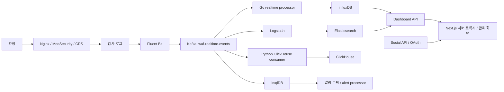

# 🛡️ 웹 애플리케이션 방화벽 (WAF) 플랫폼

Nginx + ModSecurity + OWASP CRS 기반 WAF와 Next.js 관리 화면입니다. Kafka로 감사 로그를 수집하고 InfluxDB·Elasticsearch·ClickHouse에서 조회·분석합니다.

[English](README.en.md) · [개편 판단](docs/REFORM-REVIEW.md) · [개편 계획](docs/REFORM-PLAN.md) · [규칙 관리 계약](docs/CUSTOM-RULES.md)

현재는 개발·검증용 구성입니다. 운영 보안, 처리량, 지연 시간, 고가용성을 검증한 배포 구성이 아닙니다.

## 현재 기능과 경계

- Google OAuth 로그인과 HttpOnly 세션 쿠키, 인증이 필요한 dashboard API.
- 요청 통계, 로그 검색, 실시간 로그와 최근 경고 조회. 빈 데이터와 조회 실패를 구분합니다. 실시간 경고 스트림은 아직 연결되지 않아 `501`을 반환합니다.
- 사용자 규칙과 IP/CIDR 화이트리스트 **초안** CRUD 및 파일 저장.
- 규칙 적용 API는 실제 Nginx 검증·reload 경로가 연결되기 전까지 `501`을 반환합니다. 저장과 활성 적용은 별개입니다.
- Kafka 소비자는 필수 저장이 성공한 뒤 커밋합니다. 장애 후 재처리로 중복이 발생할 수 있습니다.
- Compose와 로컬 Kubernetes용 설정을 제공합니다. Helm 차트, 운영 RBAC, 배포 오퍼레이터는 포함하지 않습니다.

## 아키텍처


```mermaid
flowchart LR
  Client[요청] --> WAF[Nginx / ModSecurity / CRS]
  WAF --> Audit[감사 로그]
  Audit --> FluentBit[Fluent Bit]
  FluentBit --> Kafka[Kafka: waf-realtime-events]
  Kafka --> Realtime[Go realtime processor]
  Realtime --> InfluxDB
  Kafka --> Logstash
  Logstash --> Elasticsearch
  Kafka --> Consumer[Python ClickHouse consumer]
  Consumer --> ClickHouse
  Kafka --> ksqlDB
  ksqlDB --> Alerts[알림 토픽 / alert processor]
  InfluxDB --> Dashboard[Dashboard API]
  Elasticsearch --> Dashboard
  Dashboard --> Next[Next.js 서버 프록시 / 관리 화면]
  Social[Social API / OAuth] --> Next
```

ClickHouse는 분석용 저장소이며 현재 dashboard API의 직접 조회 소스가 아닙니다. Go alert processor의 출력과 dashboard의 InfluxDB 기반 경고 조회도 별도 경로입니다.

## 로컬 실행

필요 도구: Docker Engine와 Compose v2. 소스 검증에는 Java 21, Node.js 20 이상, Go(`go.mod` 기준), Python 3이 필요합니다.

```bash
cp .env.example .env
# .env에 Google OAuth 자격 증명과 저장소 비밀번호/토큰을 설정합니다.
openssl rand -base64 32
# 출력 값을 JWT_SECRET으로 설정합니다.
docker compose --env-file .env config --quiet
./startup.sh --build
```

Google에 등록하는 로컬 콜백은 `http://localhost:3001/login/oauth2/code/google`입니다. `OAUTH_CALLBACK_BASE_URL`은 브라우저가 접속하는 프런트엔드 origin입니다. 두 Java API는 같은 `JWT_SECRET`을 사용합니다. 실제 환경 파일은 커밋하지 않습니다.

| 화면 | 기본 로컬 주소 |
| --- | --- |
| 관리 화면 | http://localhost:3001 |
| WAF 데모 대상 | http://localhost:8080 |
| Grafana | http://localhost:3000 |
| Kibana | http://localhost:5601 |

Nginx 기본 대상은 정적 데모 페이지입니다. 실제 애플리케이션 upstream은 배포 환경에서 별도로 구성해야 합니다. 로컬 저장소·관리 서비스 포트를 그대로 인터넷에 공개하지 않습니다.

## 검증

```bash
(cd backend && ./gradlew test)
(cd frontend && npm ci && npm run lint && npm run build)
(cd services/realtime-processor && go test ./...)
(cd services/alert-processor && go test ./...)
python3 -m unittest discover -s kafka-clickhouse-consumer/tests
python3 scripts/tests/test-runtime-config.py
```

프런트엔드 추가 회귀 테스트 명령은 `frontend/package.json`을 따릅니다. CI는 운영 자격 증명 없이 실행합니다. 단위·정적 검증만으로 실제 Google 로그인이나 전체 WAF → Kafka → 저장소 연결을 보장하지 않습니다.

## 저장과 배포

관리 초안은 `WAF_MANAGEMENT_STORE`가 가리키는 JSON 파일에 저장합니다. 볼륨을 유지하고 dashboard 프로세스는 한 개만 사용합니다. 다중 인스턴스의 동시 파일 쓰기는 지원하지 않습니다.

ClickHouse의 추가 컬럼 마이그레이션은 `clickhouse/`에 있습니다. 기존 데이터 볼륨에는 초기화 스크립트가 자동 재실행되지 않으므로 추가 마이그레이션을 별도로 실행해야 합니다. 기존 테이블을 삭제하지 않습니다.

Kubernetes 설정은 로컬 검증용 출발점입니다. Secret, 볼륨, 이미지와 준비 상태를 확인한 후 사용합니다. 운영 배포와 자동 병합은 이번 개편 범위에 포함하지 않습니다.

[개편 계획](docs/REFORM-PLAN.md)에 브랜치별 소유 범위와 후속 작업을 기록했습니다. 기존 상세 문서와 현재 동작이 충돌하면 이 README, 규칙 관리 계약, 구현 코드와 테스트를 기준으로 확인합니다.
