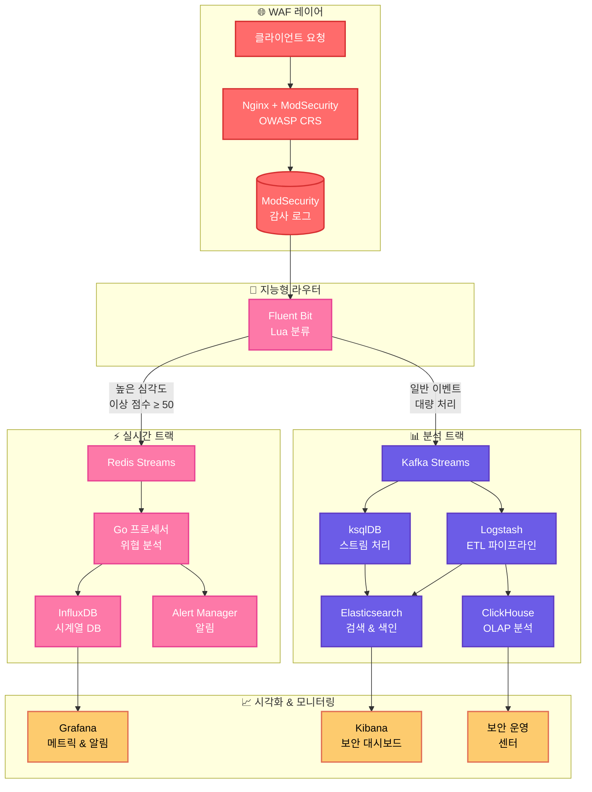

# 🛡️ 엔터프라이즈 웹 애플리케이션 방화벽 (WAF) 플랫폼


**Nginx + ModSecurity + OWASP CRS (Core Rule Set)**로 구축된 **엔터프라이즈급 웹 애플리케이션 방화벽**으로, 지능형 이중 트랙 로그 처리, 실시간 위협 탐지, 포괄적인 보안 분석 기능을 제공합니다.

[🇺🇸 English Version](README.en.md)

## 🌟 주요 기능

- **🚀 실시간 위협 탐지** - 중대한 보안 이벤트에 대한 1초 이내 대응
- **📊 이중 트랙 아키텍처** - 실시간 위협과 대량 분석 데이터를 분리 처리
- **🔍 고급 분석** - ksqlDB 스트림 처리와 ClickHouse OLAP 분석
- **⚡ 고성능** - 수평 확장으로 초당 10,000+ 요청 처리
- **🛡️ 엔터프라이즈 보안** - RBAC, 암호화, 감사 로깅, 컴플라이언스 지원
- **📈 종합 모니터링** - Grafana 대시보드, Prometheus 메트릭, 알림
- **☁️ 클라우드 네이티브** - Kubernetes 지원, Helm 차트 및 오퍼레이터
- **🔧 DevOps 지원** - CI/CD 통합, 코드형 인프라, GitOps 워크플로

---

## 📐 아키텍처 개요

WAF 플랫폼은 위협 심각도와 처리 요구사항에 따라 보안 이벤트를 지능적으로 라우팅하는 **이중 트랙 아키텍처**를 구현합니다.

### 고수준 아키텍처



### 이중 트랙 처리 전략

| 트랙 | 목적 | 지연 시간 | 사용 사례 |
|------|------|-----------|-----------|
| **실시간** | 즉시 위협 대응 | < 1초 | 중요 공격, 활성 위협, 알림 |
| **분석** | 과거 분석 및 컴플라이언스 | 5-30초 | 보고서, 포렌식, 트렌드 분석 |

---

## 🚀 빠른 시작 가이드

### 필수 요구사항

- **Docker Engine 20.10+**
- **Docker Compose v2**
- **최소 8GB RAM** (프로덕션 환경에서는 16GB 권장)
- **로그 및 데이터 저장을 위한 20GB 디스크 공간**

### 개발 환경 설정

```bash
# 저장소 클론
git clone https://github.com/rojae/waf
cd waf

# 통합 시작업 스크립트 사용 (권장)
./startup.sh
```

#### startup.sh 사용법

**1. 기본 실행 (빌드 없이)**
```bash
./startup.sh
```
- 기존 이미지로 빠르게 시작

**2. 전체 빌드 후 실행**
```bash
./startup.sh --build
# 또는
./startup.sh -b
```
- 모든 서비스 빌드 후 시작 (코드 변경사항 반영)

**3. 백엔드만 빌드**
```bash
./startup.sh --build-backend
```
- waf-dashboard-api, waf-social-api만 빌드
- Java 코드 변경시 사용

**4. 프론트엔드만 빌드**
```bash
./startup.sh --build-frontend
```
- waf-frontend만 빌드
- React/Next.js 코드 변경시 사용

#### 🎯 개발 워크플로우 예시

```bash
# Java 백엔드 코드 수정 후
./startup.sh --build-backend

# 프론트엔드 코드 수정 후  
./startup.sh --build-frontend

# 전체 시스템 새로 빌드
./startup.sh --build
```

### 프로덕션 배포

```bash
# 환경 변수 설정
export INFLUXDB_TOKEN="your-secure-token"
export KAFKA_PASSWORD="your-kafka-password"

# 프로덕션 설정으로 배포
docker-compose -f docker-compose.prod.yml up -d

# 모니터링 설정
./scripts/setup-monitoring.sh
```

### 테스트 트래픽 생성

```bash
# 정상 요청
curl "http://localhost:8080/"

# XSS 탐지 트리거 (실시간 트랙)
curl "http://localhost:8080/search?q=<script>alert('xss')</script>"

# SQL 인젝션 트리거 (실시간 트랙)
curl "http://localhost:8080/login" -d "user=admin' OR 1=1--"

# 스캐너 시뮬레이션 (분석 트랙)
curl "http://localhost:8080" -H "User-Agent: Nikto"
```

---

## 🏗️ 서비스 아키텍처

### 핵심 서비스

| 서비스 | 컨테이너 | 포트 | 목적 | 트랙 |
|---------|----------|------|------|------|
| **WAF** | `waf-nginx` | 8080 | 웹 애플리케이션 방화벽 | 공통 |
| **로그 라우터** | `waf-fluent-bit` | 2020 | 지능형 이벤트 분류 | 공통 |
| **실시간 프로세서** | `waf-realtime-processor` | - | 위협 분석 & 알림 | 실시간 |
| **스트림 플랫폼** | `waf-kafka` | 9092 | 이벤트 스트리밍 | 분석 |
| **스트림 프로세서** | `waf-ksqldb` | 8088 | 스트림 강화 | 분석 |
| **ETL 파이프라인** | `waf-logstash` | 5044 | 데이터 변환 | 분석 |

### 저장소 서비스

| 서비스 | 컨테이너 | 포트 | 목적 | 데이터 유형 |
|---------|----------|------|------|-------------|
| **시계열 DB** | `waf-influxdb` | 8086 | 실시간 메트릭 | 시계열 |
| **검색 엔진** | `waf-elasticsearch` | 9200 | 보안 이벤트 검색 | 문서 |
| **분석 DB** | `waf-clickhouse` | 8123 | OLAP 쿼리 | 컬럼형 |
| **캐시/스트림** | `waf-redis-streams` | 6380 | 실시간 이벤트 | Key-Value |
| **세션 저장소** | `waf-redis` | 6379 | 애플리케이션 상태 | Key-Value |

### 모니터링 & 시각화

| 서비스 | 컨테이너 | 포트 | 목적 |
|---------|----------|------|------|
| **보안 대시보드** | `waf-kibana` | 5601 | 이벤트 분석 및 조사 |
| **메트릭 대시보드** | `waf-grafana` | 3000 | 성능 및 상태 모니터링 |
| **소셜 API** | `waf-social-api` | 8081 | OAuth 인증 서비스 |
| **대시보드 API** | `waf-dashboard-api` | 8082 | WAF 관리 API |
| **프론트엔드** | `waf-frontend` | 3001 | 웹 관리 인터페이스 |

---

## 📊 데이터 플로우 & 토픽

### 실시간 트랙 플로우
```
ModSecurity 로그 → Fluent Bit → Redis Streams → Go 프로세서 → InfluxDB → Grafana
                                                              ↓
                                                           알림
```

### 분석 트랙 플로우  
```
ModSecurity 로그 → Fluent Bit → Kafka 토픽 → ksqlDB → 강화된 데이터
                                     ↓              ↓
                                 Logstash → Elasticsearch → Kibana
                                     ↓
                                ClickHouse → 분석 대시보드
```

### Kafka 토픽

| 토픽 | 목적 | 보존 기간 | 파티션 |
|------|------|-----------|--------|
| `waf-logs` | 원시 보안 이벤트 | 7일 | 6 |
| `waf-modsec-enriched` | 메타데이터가 포함된 처리된 이벤트 | 30일 | 6 |
| `waf-modsec-metrics` | 집계된 메트릭 | 90일 | 3 |
| `waf-rulemap` | 룰 정의 (압축) | ∞ | 1 |

### Redis 스트림

| 스트림 | 목적 | 최대 길이 |
|--------|---------|-----------|
| `waf-realtime-events` | 고위험 보안 이벤트 | 10,000 |
| `waf-alerts` | 대시보드용 중요 알림 | 1,000 |

---

## 🔧 설정 및 튜닝

### 환경 변수

#### 핵심 설정
```bash
# WAF 설정
WAF_MODE=detection                    # detection|prevention
WAF_PARANOIA_LEVEL=1                 # 1-4 (높을수록 엄격)
WAF_ANOMALY_THRESHOLD=5              # 차단 임계값
WAF_MAX_FILE_SIZE=10M                # 업로드 크기 제한

# 실시간 처리
REALTIME_SEVERITY_THRESHOLD=80       # 알림 임계값
REDIS_STREAMS_MAXLEN=10000          # 스트림 보존
INFLUXDB_RETENTION_POLICY=7d        # 메트릭 보존

# 분석 설정  
KAFKA_RETENTION_HOURS=168           # 7일 기본값
ELASTICSEARCH_RETENTION_DAYS=90     # 인덱스 라이프사이클
CLICKHOUSE_RETENTION_DAYS=365       # 분석 보존
```

#### 보안 및 인증
```bash
# 데이터베이스 보안
INFLUXDB_TOKEN=your-secure-token-here
ELASTICSEARCH_PASSWORD=your-es-password
CLICKHOUSE_PASSWORD=your-ch-password

# 소셜 로그인 설정
GOOGLE_CLIENT_ID=your-google-client-id
GOOGLE_CLIENT_SECRET=your-google-client-secret
JWT_SECRET=your-jwt-secret-32-bytes
```

---

## 📈 모니터링 & 알림

### 상태 확인

```bash
# 전체 시스템 상태
curl -s http://localhost:8080/health | jq

# 개별 서비스 상태
docker-compose ps
docker-compose logs -f realtime-processor
```

### 주요 메트릭

#### 실시간 트랙
- **이벤트 처리율**: 초당 처리된 이벤트 수
- **심각도 분포**: 중요 vs 일반 이벤트 비율
- **알림 응답 시간**: 탐지부터 알림까지의 시간
- **가양성율**: 스캐너 vs 실제 위협 비율

#### 분석 트랙
- **처리량**: Kafka를 통한 초당 메시지 수
- **컨슈머 지연**: 스트림 파이프라인의 처리 지연
- **저장소 증가**: 데이터 보존 및 정리 효율성
- **쿼리 성능**: 대시보드 및 보고서 응답 시간

### Grafana 대시보드

`http://localhost:3000`에서 Grafana 접속 (admin/admin)

1. **WAF 개요**: 고수준 보안 메트릭 및 KPI
2. **실시간 위협**: 활성 공격 및 중요 이벤트
3. **시스템 성능**: 인프라 상태 및 리소스 사용량
4. **컴플라이언스 보고서**: 보안 상태 및 감사 추적

---

## 🛠️ 운영 및 유지보수

### 로그 관리

#### 로그 로테이션
```bash
# docker-compose.yml에서 설정
services:
  nginx:
    logging:
      driver: "json-file"
      options:
        max-size: "100m"
        max-file: "5"
```

#### 로그 분석
```bash
# 특정 공격 패턴 검색
curl -X GET "localhost:9200/waf-logs-*/_search" -H 'Content-Type: application/json' -d'
{
  "query": {
    "bool": {
      "must": [
        {"range": {"@timestamp": {"gte": "now-1h"}}},
        {"term": {"rule.category": "attack-sqli"}}
      ]
    }
  }
}'
```

### 백업 및 복구

#### 데이터베이스 백업
```bash
# InfluxDB 백업
docker exec influxdb influx backup /backups/$(date +%Y%m%d)

# Elasticsearch 백업
curl -X PUT "localhost:9200/_snapshot/backup_repo/snapshot_$(date +%Y%m%d)"

# ClickHouse 백업  
docker exec clickhouse clickhouse-backup create
```

---

## 🔒 보안 및 컴플라이언스

### 보안 강화

#### 네트워크 보안
- 모든 서비스 간 통신에 TLS 1.3 사용
- Docker 네트워크를 통한 네트워크 분할 구현
- 프로덕션 배포용 방화벽 규칙 활성화
- 원격 액세스용 VPN/배스천 호스트 사용

#### 접근 제어
- 모든 대시보드에 역할 기반 접근 제어(RBAC)
- 관리자 액세스용 다단계 인증(MFA)
- 프로그래밍 액세스용 API 키 인증
- 정기 액세스 검토 및 권한 순환

---

## 🧪 테스트 및 검증

### 자동화된 테스트 스위트

```bash
# 종합 테스트 스위트 실행
./scripts/run-tests.sh

# 테스트 범주
./scripts/test-waf-rules.sh          # OWASP CRS 룰 검증
./scripts/test-performance.sh       # 로드 테스팅
./scripts/test-security.sh          # 침투 테스트
./scripts/test-integration.sh       # 엔드투엔드 검증
```

### 보안 테스트

#### OWASP Top 10 검증
```bash
# SQL 인젝션 테스트
curl -X POST "http://localhost:8080/login" \
  -d "username=admin' OR 1=1--&password=test"

# XSS 테스트  
curl "http://localhost:8080/search?q=<script>alert('xss')</script>"

# 커맨드 인젝션 테스트
curl "http://localhost:8080/ping?host=localhost;cat /etc/passwd"

# 패스 트래버설 테스트
curl "http://localhost:8080/file?path=../../../../etc/passwd"
```

---

## 🐛 문제 해결 가이드

### 일반적인 문제

#### 높은 메모리 사용량
```bash
# 컨테이너 메모리 사용량 확인
docker stats

# JVM 힙 크기 조정
export ES_JAVA_OPTS="-Xms2g -Xmx2g"
export LS_JAVA_OPTS="-Xms1g -Xmx1g"
```

#### 연결 시간 초과
```bash
# 네트워크 연결성 확인
docker network ls
docker exec waf-nginx ping kafka

# 서비스 상태 확인
curl -f http://localhost:8088/info    # ksqlDB
curl -f http://localhost:9200/_health # Elasticsearch
```

#### Redis 연결 문제
```bash
# Redis 연결 확인
docker exec waf-social-api ping redis

# Redis 서비스 재시작
docker-compose restart waf-redis waf-social-api
```

---

## 🚀 빠른 명령어

### 서비스 관리
```bash
# 특정 서비스만 재시작
docker-compose restart waf-social-api

# Redis와 social-api 함께 재시작  
docker-compose restart waf-redis waf-social-api

# 전체 재시작 (가장 확실한 방법)
docker-compose down && docker-compose up -d

# 특정 서비스 빌드 후 재시작
docker-compose build waf-social-api && docker-compose up waf-social-api -d

# 로그 실시간 확인
docker logs -f waf-social-api
```

### 개발 도구
```bash
# 프론트엔드 재시작
docker-compose restart waf-frontend

# 백엔드 API 재시작
docker-compose restart waf-dashboard-api waf-social-api

# 전체 시스템 상태 확인
docker-compose ps
```

---

## 🤝 기여 및 지원

### 개발 워크플로우

1. **Fork & Clone**: 저장소를 포크하고 기능 브랜치 생성
2. **개발**: 포괄적인 테스트와 함께 변경사항 구현
3. **테스트**: 보안 검증을 포함한 전체 테스트 스위트 실행
4. **문서화**: 관련 문서 및 README 업데이트
5. **Pull Request**: 상세한 설명과 테스트 결과를 포함한 PR 제출

### 커뮤니티 리소스

- **🐛 버그 보고**: [GitHub Issues](https://github.com/rojae/waf/issues)
- **💬 토론**: [GitHub Discussions](https://github.com/rojae/waf/discussions)
- **📖 위키**: [프로젝트 위키](https://github.com/rojae/waf/wiki)

---

## 📄 라이센스

이 프로젝트는 MIT 라이센스 하에 배포됩니다. 자세한 내용은 [LICENSE.md](LICENSE.md) 파일을 참조하세요.

### 써드파티 컴포넌트

| 컴포넌트 | 라이센스 | 목적 |
|----------|----------|------|
| Nginx | 2-clause BSD | 웹 서버 및 리버스 프록시 |
| ModSecurity | Apache 2.0 | 웹 애플리케이션 방화벽 엔진 |
| OWASP CRS | Apache 2.0 | 보안 룰 셋 |
| Apache Kafka | Apache 2.0 | 이벤트 스트리밍 플랫폼 |
| Elasticsearch | Elastic License 2.0 | 검색 및 분석 |
| InfluxDB | MIT | 시계열 데이터베이스 |
| ClickHouse | Apache 2.0 | 분석 데이터베이스 |

---

## 🏆 감사의 말

### 기여자
- **보안 팀**: 핵심 WAF 개발 및 룰 최적화
- **DevOps 팀**: 인프라 자동화 및 모니터링
- **데이터 팀**: 분석 파이프라인 및 대시보드 개발
- **QA 팀**: 테스트 자동화 및 검증 프레임워크

### 특별 감사
- **OWASP 커뮤니티**: 포괄적인 Core Rule Set 제공
- **ModSecurity 팀**: 강력한 WAF 엔진 제공
- **오픈 소스 커뮤니티**: 기반 기술 제공

---

<div align="center">

**⭐ 이 프로젝트가 인프라 보안에 도움이 되셨다면 스타를 눌러주세요!**

</div>