# 🏗️ Enterprise WAF Platform Architecture

## Table of Contents
- [System Overview](#system-overview)
- [Dual-Track Architecture](#dual-track-architecture)
- [Component Architecture](#component-architecture)
- [Data Flow Diagrams](#data-flow-diagrams)
- [Security Architecture](#security-architecture)
- [Scalability & Performance](#scalability--performance)
- [Deployment Architecture](#deployment-architecture)
- [Integration Points](#integration-points)

---

## System Overview

The Enterprise WAF Platform implements a sophisticated multi-tier architecture designed for high-performance security event processing, real-time threat detection, and comprehensive analytics.

### High-Level System Architecture


### Core Principles

1. **Separation of Concerns**: Real-time and analytics processing are completely separated
2. **Event-Driven Architecture**: All components communicate via events and streams
3. **Horizontal Scalability**: Every component can scale independently
4. **Fault Tolerance**: No single points of failure, graceful degradation
5. **Security by Design**: Defense in depth, least privilege, encrypted communications

---

## Dual-Track Architecture

The platform's core innovation is the intelligent dual-track processing system that routes events based on threat severity and processing requirements.

### Architectural Decision: Why Dual-Track?

| Challenge | Traditional Approach | Dual-Track Solution |
|-----------|---------------------|---------------------|
| **High-volume scanner noise** | All events processed equally | Scanner traffic isolated to analytics track |
| **Alert fatigue from false positives** | Manual tuning and filtering | Intelligent severity-based routing |
| **Delayed critical threat response** | Batch processing delays | Sub-second real-time processing |
| **Resource contention** | Single pipeline bottlenecks | Independent resource allocation |
| **Operational complexity** | One-size-fits-all configuration | Optimized per-track configurations |

### Track Comparison


### Processing Characteristics

| Aspect | Real-Time Track | Analytics Track |
|--------|----------------|-----------------|
| **Latency** | < 1 second | 5-30 seconds |
| **Throughput** | 1K-10K events/sec | 100K+ events/sec |
| **Storage** | Time-series (7 days) | Long-term (1+ years) |
| **Processing** | Stateful stream processing | Batch and micro-batch |
| **Use Cases** | Alerts, dashboards, investigations | Reports, compliance, ML training |
| **SLA** | 99.9% availability | 99% availability |

---

## Component Architecture

### WAF Layer Components


#### ModSecurity Configuration
- **OWASP CRS 3.3+**: 200+ security rules covering OWASP Top 10
- **Paranoia Levels**: Configurable strictness (1-4)
- **Custom Rules**: Organization-specific attack patterns
- **Anomaly Scoring**: Cumulative threat scoring system
- **JSON Audit Logs**: Structured logging for automated processing

### Event Router (Fluent Bit + Lua)

```mermaid
graph TB
    subgraph "Intelligent Event Router"
        Input[ModSecurity Logs] --> Parser[JSON Parser]
        Parser --> Classifier[Lua Classifier]
        
        subgraph "Classification Logic"
            Classifier --> AnomalyCheck{Anomaly Score ≥ 50?}
            Classifier --> RuleCheck{Critical Rule Pattern?}
            Classifier --> ScannerCheck{Scanner Pattern?}
        end
        
        AnomalyCheck -->|Yes| Realtime[Real-time Track]
        RuleCheck -->|SQLi/XSS/RCE| Realtime
        ScannerCheck -->|Scanner| Analytics[Analytics Track]
        
        AnomalyCheck -->|No| Analytics
        RuleCheck -->|No| Analytics
        
        Realtime --> RedisStreams[(Redis Streams)]
        Analytics --> KafkaTopics[(Kafka Topics)]
    end
    
    classDef router fill:#74b9ff,stroke:#0984e3,color:#fff
    classDef decision fill:#fdcb6e,stroke:#e17055,color:#000
    classDef output fill:#a29bfe,stroke:#6c5ce7,color:#fff
    
    class Input,Parser,Classifier router
    class AnomalyCheck,RuleCheck,ScannerCheck decision
    class Realtime,Analytics,RedisStreams,KafkaTopics output
```



#### Classification Rules
```lua
-- High-severity attacks (Real-time track)
critical_rules = {"942", "941", "932", "930"}  -- SQLi, XSS, RCE, LFI
anomaly_threshold = 50

-- Scanner detection patterns (Analytics track)
scanner_rules = {"913"}  -- Scanner detection rules
scanner_user_agents = {"nikto", "sqlmap", "burp", "nessus"}

-- IP reputation scoring
threat_intel_sources = {"abuseipdb", "virustotal", "custom_feeds"}
```

### Real-Time Processing Components

```mermaid
graph TB
    subgraph "Real-Time Processing Pipeline"
        Redis[(Redis Streams<br/>waf-realtime-events)]
        
        subgraph "Processing Cluster"
            Proc1[Processor Instance 1<br/>Go Microservice]
            Proc2[Processor Instance 2<br/>Go Microservice]
            Proc3[Processor Instance 3<br/>Go Microservice]
        end
        
        subgraph "Threat Analysis Engine"
            Scorer[Severity Scorer]
            Intel[Threat Intel Client]
            Rules[Rule Engine]
        end
        
        subgraph "Output Systems"
            InfluxDB[(InfluxDB<br/>Time-series DB)]
            Alerts[Alert Manager]
            Cache[Redis Cache<br/>Dashboard Data)]
        end
    end
    
    Redis --> Proc1
    Redis --> Proc2
    Redis --> Proc3
    
    Proc1 --> Scorer
    Proc2 --> Scorer
    Proc3 --> Scorer
    
    Scorer --> Intel
    Scorer --> Rules
    
    Scorer --> InfluxDB
    Scorer --> Alerts
    Scorer --> Cache
    
    classDef realtime fill:#fd79a8,stroke:#e84393,color:#fff
    classDef processing fill:#fdcb6e,stroke:#e17055,color:#000
    classDef output fill:#00b894,stroke:#00a085,color:#fff
    
    class Redis,Proc1,Proc2,Proc3 realtime
    class Scorer,Intel,Rules processing
    class InfluxDB,Alerts,Cache output
```

#### Go Microservice Architecture
```go
// Core components
type RealTimeProcessor struct {
    redisClient  *redis.Client        // Stream consumption
    influxClient influxdb2.Client     // Metrics storage
    alertManager *AlertManager        // Multi-channel alerting
    threatIntel  *ThreatIntelClient   // IP reputation
    ruleEngine   *RuleEngine          // Custom rules
    logger       *logrus.Logger       // Structured logging
}

// Processing pipeline
func (rtp *RealTimeProcessor) Process(event *SecurityEvent) {
    severity := rtp.calculateSeverity(event)
    
    // Store metrics
    rtp.storeMetrics(event, severity)
    
    // Trigger alerts if critical
    if severity >= 80 {
        rtp.triggerAlert(event, severity)
    }
    
    // Update dashboards
    rtp.updateDashboard(event, severity)
}
```

### Analytics Processing Components


#### Stream Processing Topology
```sql
-- ksqlDB stream processing examples

-- 1. Event enrichment with rule metadata
CREATE STREAM enriched_events AS
SELECT 
    e.timestamp,
    e.client_ip,
    e.rule_id,
    r.category,
    r.severity,
    GEO_IP(e.client_ip) as geo_data
FROM raw_events e
LEFT JOIN rule_lookup r ON e.rule_id = r.rule_id;

-- 2. Time-windowed aggregations
CREATE TABLE attack_metrics AS
SELECT 
    client_ip,
    rule_category,
    COUNT(*) as attack_count,
    AVG(severity_score) as avg_severity
FROM enriched_events
WINDOW TUMBLING (SIZE 1 HOUR)
GROUP BY client_ip, rule_category;

-- 3. Anomaly detection preparation
CREATE STREAM anomalies AS
SELECT *
FROM enriched_events
WHERE severity_score > 90
   OR attack_count > PERCENTILE(attack_count, 0.99);
```

---

## Data Flow Diagrams

### End-to-End Data Flow


### Real-Time Track Detailed Flow


### Analytics Track Detailed Flow


---

## Security Architecture

### Defense in Depth


### Access Control Architecture


### Encryption & Data Protection

| Layer | Component | Encryption Method | Key Management |
|-------|-----------|------------------|----------------|
| **Transport** | Client ↔ WAF | TLS 1.3 | Certificate Authority |
| **Transport** | Inter-service | mTLS | Service Mesh (Istio) |
| **Application** | Event Streams | SASL_SSL | Kafka ACLs + Certificates |
| **Storage** | Database Files | AES-256 | Vault/KMS Integration |
| **Storage** | Backup Files | AES-256-GCM | Hardware Security Module |
| **Memory** | Sensitive Data | In-memory encryption | Application-level keys |

---

## Scalability & Performance

### Horizontal Scaling Architecture


### Performance Targets

| Component | Throughput | Latency | Availability |
|-----------|------------|---------|--------------|
| **WAF Layer** | 10,000 RPS per instance | < 10ms | 99.99% |
| **Real-time Track** | 1,000 events/sec | < 1 second | 99.9% |
| **Analytics Track** | 100,000 events/sec | < 30 seconds | 99% |
| **Alert Generation** | 100 alerts/sec | < 2 seconds | 99.9% |
| **Dashboard Queries** | 100 concurrent users | < 3 seconds | 99.5% |

### Auto-scaling Triggers

```yaml
# Kubernetes HPA Configuration
apiVersion: autoscaling/v2
kind: HorizontalPodAutoscaler
metadata:
  name: waf-autoscaler
spec:
  scaleTargetRef:
    apiVersion: apps/v1
    kind: Deployment
    name: waf-nginx
  minReplicas: 3
  maxReplicas: 50
  metrics:
  - type: Resource
    resource:
      name: cpu
      target:
        type: Utilization
        averageUtilization: 70
  - type: Resource
    resource:
      name: memory
      target:
        type: Utilization
        averageUtilization: 80
  - type: Pods
    pods:
      metric:
        name: nginx_requests_per_second
      target:
        type: AverageValue
        averageValue: "8000"
```

---

## Deployment Architecture

### Multi-Environment Strategy


### Kubernetes Production Deployment

```yaml
# WAF Deployment with Anti-Affinity
apiVersion: apps/v1
kind: Deployment
metadata:
  name: waf-nginx
spec:
  replicas: 3
  selector:
    matchLabels:
      app: waf-nginx
  template:
    metadata:
      labels:
        app: waf-nginx
    spec:
      affinity:
        podAntiAffinity:
          requiredDuringSchedulingIgnoredDuringExecution:
          - labelSelector:
              matchExpressions:
              - key: app
                operator: In
                values:
                - waf-nginx
            topologyKey: kubernetes.io/hostname
      containers:
      - name: nginx
        image: waf-nginx:latest
        resources:
          requests:
            cpu: 500m
            memory: 1Gi
          limits:
            cpu: 2
            memory: 4Gi
        ports:
        - containerPort: 80
        - containerPort: 443
        volumeMounts:
        - name: modsec-logs
          mountPath: /var/log/modsecurity
      volumes:
      - name: modsec-logs
        persistentVolumeClaim:
          claimName: modsec-logs-pvc
```

### Cloud-Native Features

| Feature | AWS | Azure | GCP | Kubernetes |
|---------|-----|-------|-----|------------|
| **Load Balancing** | ALB/NLB | App Gateway | Load Balancer | Ingress |
| **Auto-scaling** | ASG | VMSS | MIG | HPA/VPA |
| **Secret Management** | Secrets Manager | Key Vault | Secret Manager | Secrets |
| **Monitoring** | CloudWatch | Monitor | Operations | Prometheus |
| **Storage** | EBS/EFS | Disk/Files | Disk/Filestore | PV/PVC |
| **Networking** | VPC | VNet | VPC | CNI |

---

## Integration Points

### External System Integrations


### API Integration Specifications

#### REST API Endpoints
```yaml
# OpenAPI 3.0 Specification
openapi: 3.0.0
info:
  title: WAF Platform API
  version: 1.0.0
  description: Enterprise WAF Platform Management API

paths:
  /api/v1/events:
    get:
      summary: Query security events
      parameters:
        - name: start_time
          schema:
            type: string
            format: date-time
        - name: severity
          schema:
            type: string
            enum: [critical, high, medium, low]
      responses:
        200:
          content:
            application/json:
              schema:
                type: array
                items:
                  $ref: '#/components/schemas/SecurityEvent'
                  
  /api/v1/alerts:
    post:
      summary: Create custom alert
      requestBody:
        content:
          application/json:
            schema:
              $ref: '#/components/schemas/Alert'
      responses:
        201:
          description: Alert created successfully
          
  /api/v1/rules:
    get:
      summary: List WAF rules
    post:
      summary: Create custom rule
      
components:
  schemas:
    SecurityEvent:
      type: object
      properties:
        id:
          type: string
        timestamp:
          type: string
          format: date-time
        severity:
          type: integer
        client_ip:
          type: string
        rule_id:
          type: string
        attack_type:
          type: string
```

#### Webhook Integrations
```json
{
  "webhook_url": "https://hooks.slack.com/services/...",
  "events": ["critical_alert", "rule_created"],
  "payload_template": {
    "text": "🚨 Critical security alert detected",
    "attachments": [
      {
        "color": "danger",
        "fields": [
          {"title": "Severity", "value": "{{severity}}", "short": true},
          {"title": "Source IP", "value": "{{client_ip}}", "short": true},
          {"title": "Attack Type", "value": "{{attack_type}}", "short": false}
        ]
      }
    ]
  }
}
```

---

## Conclusion

The Enterprise WAF Platform architecture provides a robust, scalable, and secure foundation for web application protection. The dual-track design ensures both immediate threat response and comprehensive security analytics, while the cloud-native architecture enables seamless scaling and high availability.

Key architectural strengths:
- **Intelligent Event Routing**: Reduces noise and improves response times
- **Horizontal Scalability**: Every component scales independently
- **Security by Design**: Multiple layers of defense and encryption
- **Operational Excellence**: Comprehensive monitoring and automation
- **Integration Ready**: Extensive API and webhook support

This architecture supports organizations from startup to enterprise scale, with clear upgrade paths and operational best practices built-in.