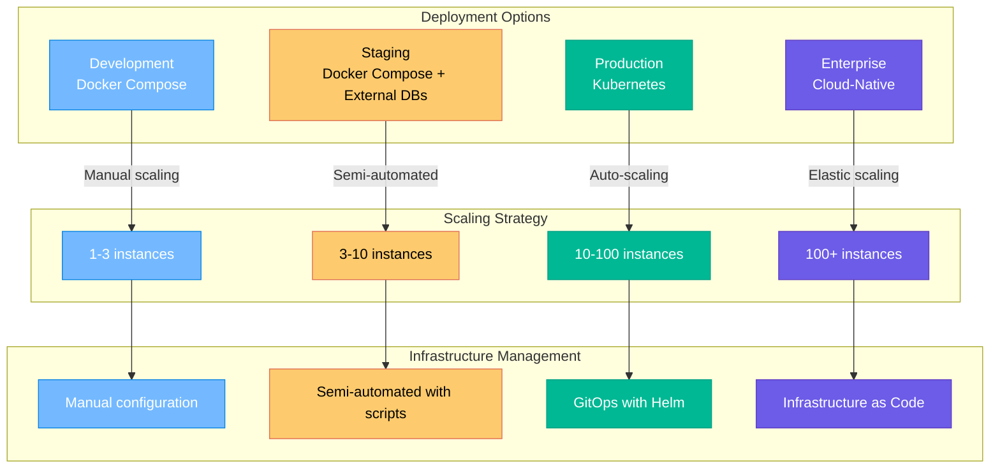
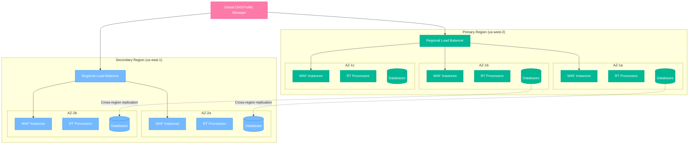

# 🚀 Enterprise WAF Platform Deployment Guide

## Table of Contents
- [Deployment Overview](#deployment-overview)
- [Environment Requirements](#environment-requirements)
- [Docker Compose Deployment](#docker-compose-deployment)
- [Kubernetes Deployment](#kubernetes-deployment)
- [Cloud Provider Deployments](#cloud-provider-deployments)
- [High Availability Setup](#high-availability-setup)
- [Security Hardening](#security-hardening)
- [Performance Optimization](#performance-optimization)
- [Monitoring Setup](#monitoring-setup)
- [Troubleshooting](#troubleshooting)

---

## Deployment Overview

The Enterprise WAF Platform supports multiple deployment strategies to meet different organizational needs:



### Deployment Matrix

| Environment | Use Case | Complexity | Scaling | HA | Cost |
|-------------|----------|------------|---------|----|----- |
| **Development** | Local testing, feature development | Low | Manual | No | Minimal |
| **Staging** | Integration testing, UAT | Medium | Semi-auto | Limited | Low |
| **Production** | Production workloads | High | Auto | Yes | Medium |
| **Enterprise** | Large-scale, multi-region | Very High | Elastic | Multi-region | High |

---

## Environment Requirements

### Hardware Requirements

#### Minimum Requirements (Development)
- **CPU**: 4 cores
- **Memory**: 8 GB RAM
- **Storage**: 50 GB SSD
- **Network**: 1 Gbps

#### Production Requirements
- **CPU**: 16+ cores per node
- **Memory**: 32+ GB RAM per node
- **Storage**: 500+ GB NVMe SSD
- **Network**: 10+ Gbps

#### Recommended Production Cluster
```yaml
# Node specifications for Kubernetes cluster
master_nodes:
  count: 3
  cpu: 8 cores
  memory: 16 GB
  storage: 100 GB SSD

worker_nodes:
  count: 6+
  cpu: 16 cores
  memory: 32 GB
  storage: 500 GB NVMe

storage_nodes:
  count: 3
  cpu: 8 cores
  memory: 64 GB
  storage: 2 TB NVMe
```

### Software Requirements

#### Base Requirements
- **Operating System**: Ubuntu 20.04+ / RHEL 8+ / CentOS 8+
- **Container Runtime**: Docker 20.10+ / containerd 1.6+
- **Orchestration**: Kubernetes 1.24+ (for production)
- **Load Balancer**: HAProxy 2.4+ / Nginx 1.20+

#### Component Versions
| Component | Minimum Version | Recommended |
|-----------|----------------|-------------|
| Docker | 20.10.0 | 24.0.0+ |
| Kubernetes | 1.24.0 | 1.28.0+ |
| Helm | 3.8.0 | 3.12.0+ |
| Nginx | 1.20.0 | 1.24.0+ |
| ModSecurity | 3.0.8 | 3.0.10+ |

---

## Docker Compose Deployment

### Development Environment

#### Quick Start
```bash
# Clone repository
git clone https://github.com/company/enterprise-waf
cd enterprise-waf

# Configure environment
cp .env.example .env
vim .env  # Edit configuration

# Deploy stack
docker-compose up -d

# Verify deployment
./scripts/health-check.sh
```

#### Environment Configuration
```bash
# .env file for development
WAF_MODE=detection
WAF_PARANOIA_LEVEL=1
WAF_ANOMALY_THRESHOLD=5

# Database configurations
INFLUXDB_TOKEN=dev-token-change-me
ELASTICSEARCH_PASSWORD=dev-password
CLICKHOUSE_PASSWORD=dev-password

# Kafka configuration
KAFKA_RETENTION_HOURS=24
KAFKA_PARTITIONS=3

# Real-time processing
REALTIME_SEVERITY_THRESHOLD=70
REDIS_STREAMS_MAXLEN=1000

# Log levels
LOG_LEVEL=info
FLUENT_BIT_LOG_LEVEL=info
```

### Production Docker Compose

#### Production Configuration
```yaml
# docker-compose.prod.yml
version: '3.8'

services:
  nginx:
    image: waf-nginx:${WAF_VERSION}
    deploy:
      replicas: 3
      resources:
        limits:
          cpus: '2.0'
          memory: 4G
        reservations:
          cpus: '1.0'
          memory: 2G
      restart_policy:
        condition: any
        delay: 5s
        max_attempts: 3
    environment:
      - WAF_MODE=prevention
      - WAF_PARANOIA_LEVEL=2
    volumes:
      - modsec-logs:/var/log/modsecurity
      - ./config/nginx-prod:/etc/nginx/conf.d
    networks:
      - waf-frontend
      - waf-backend

  kafka:
    image: confluentinc/cp-kafka:${KAFKA_VERSION}
    deploy:
      replicas: 3
      resources:
        limits:
          cpus: '4.0'
          memory: 8G
    environment:
      - KAFKA_HEAP_OPTS=-Xms4g -Xmx4g
      - KAFKA_NUM_PARTITIONS=12
      - KAFKA_DEFAULT_REPLICATION_FACTOR=3
      - KAFKA_MIN_INSYNC_REPLICAS=2
    volumes:
      - kafka-data:/var/lib/kafka/data
    networks:
      - waf-backend

networks:
  waf-frontend:
    driver: overlay
    attachable: true
  waf-backend:
    driver: overlay
    internal: true

volumes:
  modsec-logs:
    driver: local
  kafka-data:
    driver: local
```

#### Production Deployment Script
```bash
#!/bin/bash
# deploy-production.sh

set -e

# Configuration validation
echo "🔍 Validating configuration..."
if [[ -z "$INFLUXDB_TOKEN" ]]; then
    echo "❌ INFLUXDB_TOKEN not set"
    exit 1
fi

# Pre-deployment checks
echo "🔍 Running pre-deployment checks..."
docker system prune -f
docker volume create waf-data
docker network create waf-net

# Deploy infrastructure services first
echo "🚀 Deploying infrastructure services..."
docker-compose -f docker-compose.prod.yml up -d kafka redis-streams influxdb elasticsearch clickhouse

# Wait for services to be healthy
echo "⏳ Waiting for services to be ready..."
./scripts/wait-for-services.sh

# Deploy application services
echo "🚀 Deploying application services..."
docker-compose -f docker-compose.prod.yml up -d nginx fluent-bit realtime-processor logstash

# Deploy monitoring services
echo "📊 Deploying monitoring services..."
docker-compose -f docker-compose.prod.yml up -d grafana kibana

# Verify deployment
echo "✅ Verifying deployment..."
./scripts/health-check.sh --production

echo "🎉 Production deployment completed successfully!"
```

---

## Kubernetes Deployment

### Helm Chart Deployment

#### Prerequisites
```bash
# Add Helm repositories
helm repo add bitnami https://charts.bitnami.com/bitnami
helm repo add elastic https://helm.elastic.co
helm repo add influxdata https://helm.influxdata.com
helm repo update

# Create namespace
kubectl create namespace waf-system
kubectl label namespace waf-system security.company.com/managed=true
```

#### Helm Chart Structure
```
charts/enterprise-waf/
├── Chart.yaml
├── values.yaml
├── values-production.yaml
├── templates/
│   ├── deployment.yaml
│   ├── service.yaml
│   ├── ingress.yaml
│   ├── configmap.yaml
│   ├── secret.yaml
│   ├── hpa.yaml
│   ├── pdb.yaml
│   ├── networkpolicy.yaml
│   └── rbac.yaml
└── charts/
    ├── kafka/
    ├── elasticsearch/
    ├── influxdb/
    └── redis/
```

#### Production Values
```yaml
# values-production.yaml
global:
  imageRegistry: registry.company.com
  storageClass: fast-ssd

waf:
  replicaCount: 3
  image:
    repository: enterprise-waf/nginx
    tag: "1.0.0"
  resources:
    limits:
      cpu: 2000m
      memory: 4Gi
    requests:
      cpu: 1000m
      memory: 2Gi
  
  autoscaling:
    enabled: true
    minReplicas: 3
    maxReplicas: 50
    targetCPUUtilizationPercentage: 70
    targetMemoryUtilizationPercentage: 80

realtimeProcessor:
  replicaCount: 3
  image:
    repository: enterprise-waf/realtime-processor
    tag: "1.0.0"
  resources:
    limits:
      cpu: 1000m
      memory: 2Gi
    requests:
      cpu: 500m
      memory: 1Gi

kafka:
  enabled: true
  replicaCount: 3
  resources:
    limits:
      cpu: 4000m
      memory: 8Gi
  persistence:
    size: 500Gi
    storageClass: fast-ssd

elasticsearch:
  enabled: true
  replicas: 3
  resources:
    limits:
      cpu: 4000m
      memory: 8Gi
  persistence:
    size: 1Ti
    storageClass: fast-ssd

influxdb2:
  enabled: true
  resources:
    limits:
      cpu: 2000m
      memory: 4Gi
  persistence:
    size: 500Gi
    storageClass: fast-ssd

monitoring:
  enabled: true
  grafana:
    enabled: true
  prometheus:
    enabled: true

security:
  networkPolicies:
    enabled: true
  podSecurityPolicy:
    enabled: true
```

#### Deployment Commands
```bash
# Deploy to staging
helm upgrade --install waf-staging \
  ./charts/enterprise-waf \
  --namespace waf-staging \
  --create-namespace \
  --values values-staging.yaml \
  --timeout 30m

# Deploy to production
helm upgrade --install waf-production \
  ./charts/enterprise-waf \
  --namespace waf-production \
  --create-namespace \
  --values values-production.yaml \
  --timeout 30m

# Verify deployment
kubectl get pods -n waf-production
kubectl get services -n waf-production
kubectl get ingress -n waf-production
```

### Kubernetes Manifests

#### WAF Deployment
```yaml
apiVersion: apps/v1
kind: Deployment
metadata:
  name: waf-nginx
  namespace: waf-production
  labels:
    app: waf-nginx
    version: v1.0.0
spec:
  replicas: 3
  selector:
    matchLabels:
      app: waf-nginx
  template:
    metadata:
      labels:
        app: waf-nginx
        version: v1.0.0
      annotations:
        prometheus.io/scrape: "true"
        prometheus.io/port: "9113"
    spec:
      securityContext:
        runAsNonRoot: true
        runAsUser: 1001
        fsGroup: 1001
      affinity:
        podAntiAffinity:
          requiredDuringSchedulingIgnoredDuringExecution:
          - labelSelector:
              matchLabels:
                app: waf-nginx
            topologyKey: kubernetes.io/hostname
      containers:
      - name: nginx
        image: registry.company.com/enterprise-waf/nginx:1.0.0
        securityContext:
          allowPrivilegeEscalation: false
          capabilities:
            drop:
            - ALL
        resources:
          limits:
            cpu: 2000m
            memory: 4Gi
          requests:
            cpu: 1000m
            memory: 2Gi
        ports:
        - containerPort: 8080
          name: http
        - containerPort: 8443
          name: https
        - containerPort: 9113
          name: metrics
        livenessProbe:
          httpGet:
            path: /health
            port: 8080
          initialDelaySeconds: 30
          periodSeconds: 10
        readinessProbe:
          httpGet:
            path: /ready
            port: 8080
          initialDelaySeconds: 5
          periodSeconds: 5
        volumeMounts:
        - name: modsec-logs
          mountPath: /var/log/modsecurity
        - name: config
          mountPath: /etc/nginx/conf.d
        env:
        - name: WAF_MODE
          value: "prevention"
        - name: WAF_PARANOIA_LEVEL
          value: "2"
      volumes:
      - name: modsec-logs
        persistentVolumeClaim:
          claimName: modsec-logs-pvc
      - name: config
        configMap:
          name: nginx-config
```

#### Horizontal Pod Autoscaler
```yaml
apiVersion: autoscaling/v2
kind: HorizontalPodAutoscaler
metadata:
  name: waf-nginx-hpa
  namespace: waf-production
spec:
  scaleTargetRef:
    apiVersion: apps/v1
    kind: Deployment
    name: waf-nginx
  minReplicas: 3
  maxReplicas: 50
  metrics:
  - type: Resource
    resource:
      name: cpu
      target:
        type: Utilization
        averageUtilization: 70
  - type: Resource
    resource:
      name: memory
      target:
        type: Utilization
        averageUtilization: 80
  - type: Pods
    pods:
      metric:
        name: nginx_requests_per_second
      target:
        type: AverageValue
        averageValue: "8000"
  behavior:
    scaleDown:
      stabilizationWindowSeconds: 300
      policies:
      - type: Percent
        value: 10
        periodSeconds: 60
    scaleUp:
      stabilizationWindowSeconds: 60
      policies:
      - type: Percent
        value: 50
        periodSeconds: 60
```

---

## Cloud Provider Deployments

### AWS Deployment

#### Infrastructure as Code (Terraform)
```hcl
# main.tf
provider "aws" {
  region = var.aws_region
}

# EKS Cluster
module "eks" {
  source = "terraform-aws-modules/eks/aws"
  
  cluster_name    = "waf-production"
  cluster_version = "1.28"
  
  vpc_id     = module.vpc.vpc_id
  subnet_ids = module.vpc.private_subnets
  
  node_groups = {
    waf_nodes = {
      instance_types = ["m5.2xlarge"]
      min_size      = 3
      max_size      = 50
      desired_size  = 6
      
      k8s_labels = {
        role = "waf-worker"
      }
    }
    
    storage_nodes = {
      instance_types = ["r5.4xlarge"]
      min_size      = 3
      max_size      = 6
      desired_size  = 3
      
      k8s_labels = {
        role = "storage"
      }
      
      taints = [{
        key    = "storage-node"
        value  = "true"
        effect = "NO_SCHEDULE"
      }]
    }
  }
  
  tags = {
    Environment = "production"
    Project     = "enterprise-waf"
  }
}

# Application Load Balancer
resource "aws_lb" "waf_alb" {
  name               = "waf-production-alb"
  internal           = false
  load_balancer_type = "application"
  security_groups    = [aws_security_group.alb.id]
  subnets           = module.vpc.public_subnets
  
  enable_deletion_protection = true
  
  tags = {
    Name = "waf-production-alb"
  }
}

# RDS for Metadata
resource "aws_db_instance" "metadata" {
  identifier = "waf-metadata"
  
  engine         = "postgres"
  engine_version = "15.3"
  instance_class = "db.r5.2xlarge"
  
  allocated_storage     = 1000
  max_allocated_storage = 10000
  storage_encrypted     = true
  
  multi_az               = true
  backup_retention_period = 7
  backup_window          = "03:00-04:00"
  maintenance_window     = "sun:04:00-sun:05:00"
  
  tags = {
    Name = "waf-metadata"
  }
}

# ElastiCache for Redis
resource "aws_elasticache_replication_group" "redis" {
  replication_group_id       = "waf-redis"
  description                = "Redis cluster for WAF"
  
  node_type                  = "cache.r6g.2xlarge"
  port                       = 6379
  parameter_group_name       = "default.redis7"
  
  num_cache_clusters         = 3
  automatic_failover_enabled = true
  multi_az_enabled          = true
  
  subnet_group_name = aws_elasticache_subnet_group.redis.name
  security_group_ids = [aws_security_group.redis.id]
  
  at_rest_encryption_enabled = true
  transit_encryption_enabled = true
  
  tags = {
    Name = "waf-redis"
  }
}
```

#### AWS Deployment Script
```bash
#!/bin/bash
# deploy-aws.sh

set -e

# Configure AWS CLI
export AWS_DEFAULT_REGION=us-west-2
export AWS_PROFILE=waf-production

# Deploy infrastructure
echo "🏗️  Deploying AWS infrastructure..."
cd terraform/aws
terraform init
terraform plan -out=tfplan
terraform apply tfplan

# Configure kubectl
echo "🔧 Configuring kubectl..."
aws eks update-kubeconfig --name waf-production --region us-west-2

# Install AWS Load Balancer Controller
echo "🚀 Installing AWS Load Balancer Controller..."
helm repo add eks https://aws.github.io/eks-charts
helm upgrade --install aws-load-balancer-controller eks/aws-load-balancer-controller \
  --namespace kube-system \
  --set clusterName=waf-production \
  --set serviceAccount.create=false \
  --set serviceAccount.name=aws-load-balancer-controller

# Deploy WAF platform
echo "🛡️  Deploying WAF platform..."
helm upgrade --install waf-production ./charts/enterprise-waf \
  --namespace waf-production \
  --create-namespace \
  --values values-aws-production.yaml

echo "✅ AWS deployment completed!"
```

### Azure Deployment

#### ARM Template
```json
{
  "$schema": "https://schema.management.azure.com/schemas/2019-04-01/deploymentTemplate.json#",
  "contentVersion": "1.0.0.0",
  "parameters": {
    "clusterName": {
      "type": "string",
      "defaultValue": "waf-production"
    },
    "nodeCount": {
      "type": "int",
      "defaultValue": 6
    }
  },
  "resources": [
    {
      "type": "Microsoft.ContainerService/managedClusters",
      "apiVersion": "2023-07-01",
      "name": "[parameters('clusterName')]",
      "location": "[resourceGroup().location]",
      "properties": {
        "kubernetesVersion": "1.28.0",
        "dnsPrefix": "[parameters('clusterName')]",
        "agentPoolProfiles": [
          {
            "name": "wafnodes",
            "count": "[parameters('nodeCount')]",
            "vmSize": "Standard_D8s_v3",
            "osType": "Linux",
            "mode": "System"
          }
        ],
        "servicePrincipalProfile": {
          "clientId": "[parameters('servicePrincipalClientId')]",
          "secret": "[parameters('servicePrincipalClientSecret')]"
        },
        "networkProfile": {
          "networkPlugin": "azure",
          "serviceCidr": "10.0.0.0/16",
          "dnsServiceIP": "10.0.0.10",
          "dockerBridgeCidr": "172.17.0.1/16"
        }
      }
    }
  ]
}
```

### Google Cloud Deployment

#### GKE Configuration
```yaml
# gke-cluster.yaml
apiVersion: container.v1
kind: Cluster
metadata:
  name: waf-production
spec:
  location: us-central1
  initialNodeCount: 6
  
  nodeConfig:
    machineType: n1-standard-8
    diskSizeGb: 100
    diskType: pd-ssd
    oauthScopes:
    - https://www.googleapis.com/auth/cloud-platform
    
  masterAuth:
    clientCertificateConfig:
      issueClientCertificate: false
      
  networkPolicy:
    enabled: true
    
  addonsConfig:
    httpLoadBalancing:
      disabled: false
    networkPolicyConfig:
      disabled: false
      
  workloadIdentityConfig:
    workloadPool: PROJECT_ID.svc.id.goog
```

---

## High Availability Setup

### Multi-Region Architecture



### Disaster Recovery Strategy

#### RTO/RPO Requirements
| Component | RTO (Recovery Time) | RPO (Recovery Point) | Strategy |
|-----------|-------------------|---------------------|----------|
| **WAF Layer** | < 5 minutes | 0 | Active-Active multi-region |
| **Real-time Data** | < 15 minutes | < 1 minute | Cross-region streaming replication |
| **Analytics Data** | < 4 hours | < 15 minutes | Automated backup with cross-region copy |
| **Configuration** | < 30 minutes | 0 | Git-based configuration management |

#### Failover Procedures
```bash
#!/bin/bash
# disaster-recovery.sh

SECONDARY_REGION="us-east-1"
PRIMARY_REGION="us-west-2"

# Function to check primary region health
check_primary_health() {
    kubectl get nodes --context=primary-cluster >/dev/null 2>&1
    return $?
}

# Function to promote secondary to primary
promote_secondary() {
    echo "🚨 Promoting secondary region to primary..."
    
    # Update DNS to point to secondary region
    aws route53 change-resource-record-sets \
        --hosted-zone-id Z1234567890 \
        --change-batch file://failover-dns.json
    
    # Scale up secondary region
    kubectl --context=secondary-cluster \
        scale deployment waf-nginx --replicas=6
    
    # Update monitoring
    curl -X POST "https://monitoring.company.com/api/v1/alerts" \
        -d '{"alert": "DR_ACTIVATED", "region": "'$SECONDARY_REGION'"}'
    
    echo "✅ Failover completed"
}

# Main failover logic
if ! check_primary_health; then
    echo "❌ Primary region unhealthy, initiating failover..."
    promote_secondary
else
    echo "✅ Primary region healthy"
fi
```

---

## Security Hardening

### Container Security

#### Security Contexts
```yaml
securityContext:
  runAsNonRoot: true
  runAsUser: 1001
  runAsGroup: 1001
  fsGroup: 1001
  allowPrivilegeEscalation: false
  capabilities:
    drop:
    - ALL
  readOnlyRootFilesystem: true
  seccompProfile:
    type: RuntimeDefault
```

#### Pod Security Standards
```yaml
apiVersion: v1
kind: Namespace
metadata:
  name: waf-production
  labels:
    pod-security.kubernetes.io/enforce: restricted
    pod-security.kubernetes.io/audit: restricted
    pod-security.kubernetes.io/warn: restricted
```

### Network Security

#### Network Policies
```yaml
apiVersion: networking.k8s.io/v1
kind: NetworkPolicy
metadata:
  name: waf-network-policy
spec:
  podSelector:
    matchLabels:
      app: waf-nginx
  policyTypes:
  - Ingress
  - Egress
  ingress:
  - from:
    - namespaceSelector:
        matchLabels:
          name: ingress-nginx
    ports:
    - protocol: TCP
      port: 8080
  egress:
  - to:
    - podSelector:
        matchLabels:
          app: redis-streams
    ports:
    - protocol: TCP
      port: 6379
  - to:
    - podSelector:
        matchLabels:
          app: kafka
    ports:
    - protocol: TCP
      port: 9092
```

### Secret Management

#### External Secrets Operator
```yaml
apiVersion: external-secrets.io/v1beta1
kind: SecretStore
metadata:
  name: vault-secret-store
spec:
  provider:
    vault:
      server: "https://vault.company.com"
      path: "secret"
      version: "v2"
      auth:
        kubernetes:
          mountPath: "kubernetes"
          role: "waf-production"

---
apiVersion: external-secrets.io/v1beta1
kind: ExternalSecret
metadata:
  name: database-credentials
spec:
  refreshInterval: 1h
  secretStoreRef:
    name: vault-secret-store
    kind: SecretStore
  target:
    name: database-secret
    creationPolicy: Owner
  data:
  - secretKey: influxdb-token
    remoteRef:
      key: database/influxdb
      property: token
```

---

## Performance Optimization

### Resource Allocation

#### CPU and Memory Optimization
```yaml
# High-performance configuration
resources:
  limits:
    cpu: 4000m
    memory: 8Gi
  requests:
    cpu: 2000m
    memory: 4Gi

# JVM tuning for Java components
env:
- name: JAVA_OPTS
  value: >-
    -Xms4g -Xmx6g
    -XX:+UseG1GC
    -XX:MaxGCPauseMillis=200
    -XX:+UnlockExperimentalVMOptions
    -XX:+UseCGroupMemoryLimitForHeap
    -Dcom.sun.management.jmxremote
    -Dcom.sun.management.jmxremote.authenticate=false
    -Dcom.sun.management.jmxremote.ssl=false
```

### Storage Optimization

#### Storage Classes
```yaml
apiVersion: storage.k8s.io/v1
kind: StorageClass
metadata:
  name: fast-ssd
provisioner: kubernetes.io/aws-ebs
parameters:
  type: gp3
  iops: "10000"
  throughput: "500"
  encrypted: "true"
volumeBindingMode: WaitForFirstConsumer
reclaimPolicy: Retain
```

### Network Optimization

#### Service Mesh Configuration
```yaml
apiVersion: install.istio.io/v1alpha1
kind: IstioOperator
metadata:
  name: waf-istio
spec:
  values:
    global:
      meshID: waf-mesh
      network: waf-network
    pilot:
      env:
        EXTERNAL_ISTIOD: false
  components:
    proxy:
      k8s:
        resources:
          requests:
            cpu: 100m
            memory: 128Mi
          limits:
            cpu: 2000m
            memory: 1Gi
```

---

This deployment guide provides comprehensive instructions for deploying the Enterprise WAF Platform across different environments and cloud providers, with detailed configurations for high availability, security, and performance optimization.