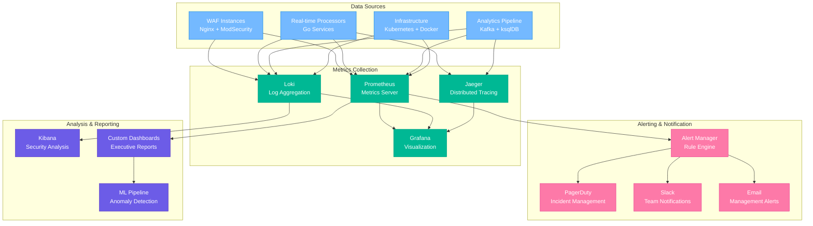
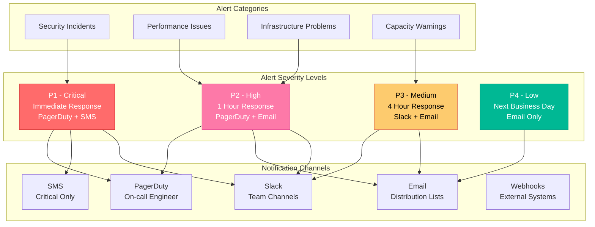
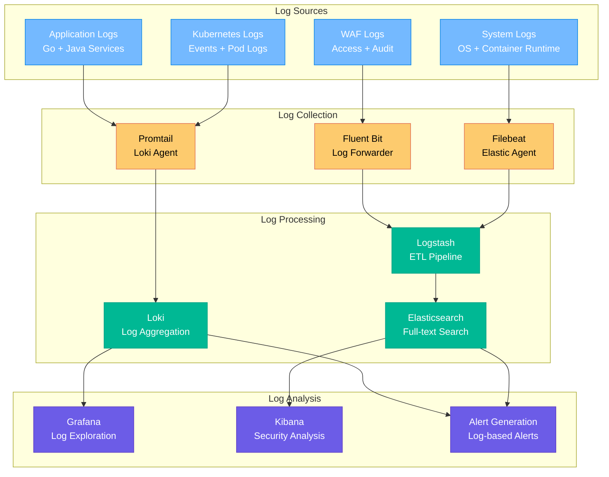

# 📊 Enterprise WAF Platform Monitoring & Operations Guide

## Table of Contents
- [Monitoring Overview](#monitoring-overview)
- [Metrics Collection](#metrics-collection)
- [Dashboard Configuration](#dashboard-configuration)
- [Alerting Strategy](#alerting-strategy)
- [Log Management](#log-management)
- [Performance Monitoring](#performance-monitoring)
- [Security Monitoring](#security-monitoring)
- [Troubleshooting Runbooks](#troubleshooting-runbooks)
- [Capacity Planning](#capacity-planning)
- [Compliance Reporting](#compliance-reporting)

---

## Monitoring Overview

The Enterprise WAF Platform implements a comprehensive monitoring strategy using industry-standard tools and best practices for observability, security monitoring, and operational excellence.

### Monitoring Architecture



### Key Monitoring Objectives

1. **Security Posture**: Real-time threat detection and response
2. **System Health**: Infrastructure and application performance
3. **Business Impact**: Service availability and user experience
4. **Compliance**: Audit trails and regulatory requirements
5. **Capacity Planning**: Resource utilization and scaling decisions

---

## Metrics Collection

### Prometheus Configuration

#### Scrape Configuration
```yaml
# prometheus.yml
global:
  scrape_interval: 15s
  evaluation_interval: 15s

rule_files:
  - "waf_rules.yml"
  - "infrastructure_rules.yml"
  - "security_rules.yml"

scrape_configs:
  # WAF Nginx metrics
  - job_name: 'waf-nginx'
    static_configs:
      - targets: ['nginx:9113']
    metrics_path: /metrics
    scrape_interval: 10s
    
  # Real-time processor metrics
  - job_name: 'realtime-processor'
    kubernetes_sd_configs:
      - role: pod
    relabel_configs:
      - source_labels: [__meta_kubernetes_pod_label_app]
        action: keep
        regex: realtime-processor
      - source_labels: [__meta_kubernetes_pod_container_port_name]
        action: keep
        regex: metrics
    
  # Kafka metrics
  - job_name: 'kafka'
    static_configs:
      - targets: ['kafka:9308']
    
  # InfluxDB metrics
  - job_name: 'influxdb'
    static_configs:
      - targets: ['influxdb:8086']
    metrics_path: /metrics
    
  # Elasticsearch metrics
  - job_name: 'elasticsearch'
    static_configs:
      - targets: ['elasticsearch:9200']
    metrics_path: /_prometheus/metrics
```

### Custom Metrics

#### WAF Security Metrics
```go
// Go metrics for real-time processor
import (
    "github.com/prometheus/client_golang/prometheus"
    "github.com/prometheus/client_golang/prometheus/promauto"
)

var (
    // Event processing metrics
    eventsProcessed = promauto.NewCounterVec(
        prometheus.CounterOpts{
            Name: "waf_events_processed_total",
            Help: "Total number of security events processed",
        },
        []string{"severity", "rule_category"},
    )
    
    // Severity distribution
    severityScores = promauto.NewHistogramVec(
        prometheus.HistogramOpts{
            Name: "waf_severity_scores",
            Help: "Distribution of severity scores",
            Buckets: []float64{10, 25, 50, 75, 90, 95, 99},
        },
        []string{"rule_category"},
    )
    
    // Alert generation metrics
    alertsGenerated = promauto.NewCounterVec(
        prometheus.CounterOpts{
            Name: "waf_alerts_generated_total",
            Help: "Total number of alerts generated",
        },
        []string{"alert_type", "severity"},
    )
    
    // Processing latency
    processingLatency = promauto.NewHistogramVec(
        prometheus.HistogramOpts{
            Name: "waf_processing_latency_seconds",
            Help: "Time taken to process security events",
            Buckets: prometheus.DefBuckets,
        },
        []string{"processor_id"},
    )
)

// Usage in processor
func (rtp *RealTimeProcessor) processMessage(event SecurityEvent) {
    start := time.Now()
    defer func() {
        processingLatency.WithLabelValues(rtp.processorID).Observe(time.Since(start).Seconds())
    }()
    
    severity := rtp.calculateSeverity(event)
    
    eventsProcessed.WithLabelValues(
        getSeverityLabel(severity),
        event.Classification.RuleCategory,
    ).Inc()
    
    severityScores.WithLabelValues(event.Classification.RuleCategory).Observe(float64(severity))
    
    if severity >= 80 {
        alertsGenerated.WithLabelValues("critical", "high").Inc()
        rtp.triggerAlert(event, severity)
    }
}
```

#### Nginx ModSecurity Metrics
```nginx
# nginx.conf with prometheus exporter
http {
    # Prometheus metrics
    upstream prometheus_exporter {
        server prometheus-nginx-exporter:9113;
    }
    
    # Status page for metrics collection
    server {
        listen 8080;
        location /nginx_status {
            stub_status on;
            access_log off;
            allow 127.0.0.1;
            allow 10.0.0.0/8;
            deny all;
        }
        
        location /metrics {
            proxy_pass http://prometheus_exporter;
        }
    }
    
    # Custom log format for metrics
    log_format metrics '$remote_addr - $remote_user [$time_local] '
                      '"$request" $status $body_bytes_sent '
                      '"$http_referer" "$http_user_agent" '
                      'rt=$request_time uct="$upstream_connect_time" '
                      'uht="$upstream_header_time" urt="$upstream_response_time"'
                      'modsec_score="$modsec_score" modsec_rule="$modsec_rule"';
}
```

### Application Performance Metrics

#### Key Performance Indicators (KPIs)
```yaml
# Kubernetes ServiceMonitor for custom metrics
apiVersion: monitoring.coreos.com/v1
kind: ServiceMonitor
metadata:
  name: waf-application-metrics
spec:
  selector:
    matchLabels:
      app: waf-nginx
  endpoints:
  - port: metrics
    interval: 15s
    path: /metrics
    
---
# PrometheusRule for SLI/SLO tracking
apiVersion: monitoring.coreos.com/v1
kind: PrometheusRule
metadata:
  name: waf-slo-rules
spec:
  groups:
  - name: waf.slo
    rules:
    # Availability SLO (99.9%)
    - expr: |
        (
          sum(rate(nginx_http_requests_total{status!~"5.."}[5m])) /
          sum(rate(nginx_http_requests_total[5m]))
        ) * 100
      record: waf:availability_percentage
      
    # Latency SLO (95th percentile < 100ms)
    - expr: |
        histogram_quantile(0.95, 
          sum(rate(nginx_http_request_duration_seconds_bucket[5m])) by (le)
        ) * 1000
      record: waf:latency_p95_milliseconds
      
    # Error rate SLO (< 0.1%)
    - expr: |
        (
          sum(rate(nginx_http_requests_total{status=~"5.."}[5m])) /
          sum(rate(nginx_http_requests_total[5m]))
        ) * 100
      record: waf:error_rate_percentage
```

---

## Dashboard Configuration

### Grafana Dashboard Structure

#### Executive Dashboard
```json
{
  "dashboard": {
    "title": "WAF Executive Dashboard",
    "tags": ["waf", "security", "executive"],
    "panels": [
      {
        "title": "Security Overview",
        "type": "stat",
        "gridPos": {"h": 8, "w": 24, "x": 0, "y": 0},
        "targets": [
          {
            "expr": "sum(increase(waf_events_processed_total[24h]))",
            "legendFormat": "Events Processed (24h)"
          },
          {
            "expr": "sum(increase(waf_alerts_generated_total[24h]))",
            "legendFormat": "Alerts Generated (24h)"
          }
        ]
      },
      {
        "title": "Threat Landscape",
        "type": "piechart",
        "gridPos": {"h": 8, "w": 12, "x": 0, "y": 8},
        "targets": [
          {
            "expr": "sum by (rule_category) (increase(waf_events_processed_total[24h]))",
            "legendFormat": "{{rule_category}}"
          }
        ]
      },
      {
        "title": "Geographic Attack Distribution",
        "type": "worldmap",
        "gridPos": {"h": 8, "w": 12, "x": 12, "y": 8},
        "targets": [
          {
            "expr": "sum by (country) (increase(waf_events_by_country_total[1h]))",
            "legendFormat": "{{country}}"
          }
        ]
      }
    ]
  }
}
```

#### Operations Dashboard
```json
{
  "dashboard": {
    "title": "WAF Operations Dashboard",
    "tags": ["waf", "operations", "sre"],
    "panels": [
      {
        "title": "System Health",
        "type": "graph",
        "gridPos": {"h": 8, "w": 24, "x": 0, "y": 0},
        "targets": [
          {
            "expr": "up{job=~\"waf.*\"}",
            "legendFormat": "{{job}} - {{instance}}"
          }
        ]
      },
      {
        "title": "Request Rate",
        "type": "graph",
        "gridPos": {"h": 8, "w": 12, "x": 0, "y": 8},
        "targets": [
          {
            "expr": "sum(rate(nginx_http_requests_total[5m]))",
            "legendFormat": "Requests/sec"
          }
        ]
      },
      {
        "title": "Response Times",
        "type": "graph",
        "gridPos": {"h": 8, "w": 12, "x": 12, "y": 8},
        "targets": [
          {
            "expr": "histogram_quantile(0.50, sum(rate(nginx_http_request_duration_seconds_bucket[5m])) by (le))",
            "legendFormat": "50th percentile"
          },
          {
            "expr": "histogram_quantile(0.95, sum(rate(nginx_http_request_duration_seconds_bucket[5m])) by (le))",
            "legendFormat": "95th percentile"
          }
        ]
      }
    ]
  }
}
```

#### Security Analyst Dashboard
```json
{
  "dashboard": {
    "title": "Security Analyst Dashboard",
    "tags": ["waf", "security", "analyst"],
    "panels": [
      {
        "title": "Real-time Threats",
        "type": "table",
        "gridPos": {"h": 10, "w": 24, "x": 0, "y": 0},
        "targets": [
          {
            "expr": "topk(10, sum by (client_ip, rule_id) (increase(waf_events_processed_total{severity=\"critical\"}[1h])))",
            "format": "table",
            "instant": true
          }
        ],
        "transformations": [
          {
            "id": "organize",
            "options": {
              "excludeByName": {
                "Time": true
              },
              "renameByName": {
                "client_ip": "Source IP",
                "rule_id": "Rule ID",
                "Value": "Event Count"
              }
            }
          }
        ]
      },
      {
        "title": "Attack Patterns",
        "type": "heatmap",
        "gridPos": {"h": 8, "w": 24, "x": 0, "y": 10},
        "targets": [
          {
            "expr": "sum by (rule_category) (rate(waf_events_processed_total[5m]))",
            "legendFormat": "{{rule_category}}"
          }
        ]
      }
    ]
  }
}
```

### Dashboard Automation

#### Dashboard Provisioning
```yaml
# grafana/provisioning/dashboards/waf-dashboards.yaml
apiVersion: 1

providers:
  - name: 'waf-dashboards'
    orgId: 1
    folder: 'WAF Platform'
    type: file
    disableDeletion: false
    updateIntervalSeconds: 30
    allowUiUpdates: true
    options:
      path: /var/lib/grafana/dashboards/waf
```

#### Automated Dashboard Updates
```bash
#!/bin/bash
# update-dashboards.sh

set -e

GRAFANA_URL="http://grafana:3000"
GRAFANA_API_KEY="${GRAFANA_API_KEY}"

# Function to update dashboard
update_dashboard() {
    local dashboard_file=$1
    local dashboard_name=$(basename "$dashboard_file" .json)
    
    echo "📊 Updating dashboard: $dashboard_name"
    
    curl -X POST "${GRAFANA_URL}/api/dashboards/db" \
        -H "Authorization: Bearer ${GRAFANA_API_KEY}" \
        -H "Content-Type: application/json" \
        -d @"$dashboard_file"
}

# Update all dashboards
for dashboard in dashboards/*.json; do
    update_dashboard "$dashboard"
done

echo "✅ All dashboards updated successfully"
```

---

## Alerting Strategy

### Alert Hierarchy



### Prometheus Alerting Rules

#### Security Alerts
```yaml
# security-alerts.yml
groups:
- name: waf.security
  rules:
  # Critical security events
  - alert: CriticalSecurityEvent
    expr: increase(waf_alerts_generated_total{severity="critical"}[5m]) > 5
    for: 0m
    labels:
      severity: P1
      category: security
    annotations:
      summary: "Multiple critical security events detected"
      description: "{{ $value }} critical security events in the last 5 minutes"
      runbook_url: "https://runbooks.company.com/waf/critical-security-event"
      
  # SQL Injection attack pattern
  - alert: SQLInjectionAttack
    expr: increase(waf_events_processed_total{rule_category="attack-sqli"}[2m]) > 10
    for: 30s
    labels:
      severity: P1
      category: security
      attack_type: sqli
    annotations:
      summary: "SQL Injection attack detected"
      description: "{{ $value }} SQL injection attempts in 2 minutes"
      
  # Anomaly in attack patterns
  - alert: AttackPatternAnomaly
    expr: |
      (
        sum(rate(waf_events_processed_total[1h])) - 
        avg_over_time(sum(rate(waf_events_processed_total[1h]))[7d:1h])
      ) / avg_over_time(sum(rate(waf_events_processed_total[1h]))[7d:1h]) > 2
    for: 15m
    labels:
      severity: P2
      category: security
    annotations:
      summary: "Unusual attack pattern detected"
      description: "Attack rate is {{ $value | humanizePercentage }} above normal baseline"
```

#### Performance Alerts
```yaml
# performance-alerts.yml
groups:
- name: waf.performance
  rules:
  # High latency
  - alert: HighLatency
    expr: histogram_quantile(0.95, sum(rate(nginx_http_request_duration_seconds_bucket[5m])) by (le)) > 0.5
    for: 5m
    labels:
      severity: P2
      category: performance
    annotations:
      summary: "High request latency detected"
      description: "95th percentile latency is {{ $value | humanizeDuration }}"
      
  # Error rate spike
  - alert: HighErrorRate
    expr: |
      (
        sum(rate(nginx_http_requests_total{status=~"5.."}[5m])) /
        sum(rate(nginx_http_requests_total[5m]))
      ) * 100 > 5
    for: 2m
    labels:
      severity: P2
      category: performance
    annotations:
      summary: "High error rate detected"
      description: "Error rate is {{ $value | humanizePercentage }}"
```

#### Infrastructure Alerts
```yaml
# infrastructure-alerts.yml
groups:
- name: waf.infrastructure
  rules:
  # Service down
  - alert: ServiceDown
    expr: up{job=~"waf.*"} == 0
    for: 1m
    labels:
      severity: P1
      category: infrastructure
    annotations:
      summary: "WAF service is down"
      description: "{{ $labels.job }} on {{ $labels.instance }} has been down for more than 1 minute"
      
  # High memory usage
  - alert: HighMemoryUsage
    expr: (node_memory_MemTotal_bytes - node_memory_MemAvailable_bytes) / node_memory_MemTotal_bytes > 0.9
    for: 5m
    labels:
      severity: P2
      category: infrastructure
    annotations:
      summary: "High memory usage"
      description: "Memory usage is above 90% on {{ $labels.instance }}"
      
  # Disk space low
  - alert: LowDiskSpace
    expr: (node_filesystem_size_bytes - node_filesystem_free_bytes) / node_filesystem_size_bytes > 0.85
    for: 10m
    labels:
      severity: P3
      category: infrastructure
    annotations:
      summary: "Low disk space"
      description: "Disk usage is above 85% on {{ $labels.instance }}"
```

### AlertManager Configuration

```yaml
# alertmanager.yml
global:
  smtp_smarthost: 'smtp.company.com:587'
  smtp_from: 'waf-alerts@company.com'
  pagerduty_url: 'https://events.pagerduty.com/v2/enqueue'

templates:
  - '/etc/alertmanager/templates/*.tmpl'

route:
  group_by: ['alertname', 'cluster', 'service']
  group_wait: 10s
  group_interval: 10s
  repeat_interval: 1h
  receiver: 'default'
  routes:
  
  # P1 Critical alerts
  - match:
      severity: P1
    receiver: 'pagerduty-critical'
    group_wait: 0s
    repeat_interval: 5m
    
  # P2 High priority alerts
  - match:
      severity: P2
    receiver: 'pagerduty-high'
    repeat_interval: 30m
    
  # Security alerts to dedicated channel
  - match:
      category: security
    receiver: 'security-team'
    
  # Infrastructure alerts
  - match:
      category: infrastructure
    receiver: 'infrastructure-team'

receivers:
- name: 'default'
  email_configs:
  - to: 'waf-team@company.com'
    subject: '[WAF] {{ .GroupLabels.alertname }}'
    body: |
      {{ range .Alerts }}
      Alert: {{ .Annotations.summary }}
      Description: {{ .Annotations.description }}
      {{ end }}

- name: 'pagerduty-critical'
  pagerduty_configs:
  - service_key: 'YOUR_PAGERDUTY_SERVICE_KEY'
    description: '{{ .GroupLabels.alertname }}: {{ .CommonAnnotations.summary }}'
    severity: 'critical'
  slack_configs:
  - api_url: 'YOUR_SLACK_WEBHOOK_URL'
    channel: '#waf-alerts'
    color: 'danger'
    title: '🚨 CRITICAL: {{ .GroupLabels.alertname }}'
    text: '{{ .CommonAnnotations.summary }}'

- name: 'security-team'
  slack_configs:
  - api_url: 'YOUR_SLACK_WEBHOOK_URL'
    channel: '#security-alerts'
    color: 'warning'
    title: '🛡️ Security Alert: {{ .GroupLabels.alertname }}'
    text: '{{ .CommonAnnotations.summary }}\n{{ .CommonAnnotations.description }}'
```

---

## Log Management

### Centralized Logging Architecture



### Log Retention Policies

| Log Type | Retention Period | Storage Tier | Compression | Backup |
|----------|------------------|--------------|-------------|--------|
| **WAF Audit Logs** | 1 year | Hot (3 months) + Cold | gzip | Weekly |
| **Application Logs** | 90 days | Hot (30 days) + Cold | snappy | Daily |
| **System Logs** | 30 days | Hot only | gzip | Daily |
| **Security Events** | 7 years | Hot (1 year) + Archive | lz4 | Daily |
| **Performance Metrics** | 1 year | Hot (3 months) + Cold | snappy | Weekly |

### Log Parsing and Enrichment

#### ModSecurity Log Parsing
```ruby
# logstash/pipeline/modsecurity.conf
filter {
  if [fields][log_type] == "modsecurity" {
    json {
      source => "message"
    }
    
    # Extract transaction details
    mutate {
      add_field => {
        "[@metadata][transaction_id]" => "%{[transaction][id]}"
        "[@metadata][client_ip]" => "%{[transaction][client_ip]}"
        "[@metadata][anomaly_score]" => "%{[transaction][anomaly_score]}"
      }
    }
    
    # GeoIP enrichment
    geoip {
      source => "[@metadata][client_ip]"
      target => "[geoip]"
    }
    
    # Threat intelligence lookup
    translate {
      source => "[@metadata][client_ip]"
      target => "[threat_intel]"
      dictionary_path => "/etc/logstash/threat_intel.yml"
    }
    
    # Calculate risk score
    ruby {
      code => '
        anomaly_score = event.get("[@metadata][anomaly_score]").to_i
        threat_score = event.get("[threat_intel][score]").to_i
        geo_risk = event.get("[geoip][country_code2]") == "CN" ? 10 : 0
        
        total_risk = anomaly_score + threat_score + geo_risk
        event.set("[risk_score]", total_risk)
        
        if total_risk >= 80
          event.set("[risk_level]", "critical")
        elsif total_risk >= 60
          event.set("[risk_level]", "high")
        elsif total_risk >= 40
          event.set("[risk_level]", "medium")
        else
          event.set("[risk_level]", "low")
        end
      '
    }
  }
}
```

---

## Performance Monitoring

### SLA/SLO Definitions

#### Service Level Objectives
| Metric | Target | Measurement Window | Error Budget |
|--------|--------|--------------------|--------------|
| **Availability** | 99.9% | 30 days | 43.8 minutes |
| **Latency (p95)** | < 100ms | 5 minutes | 5% above threshold |
| **Error Rate** | < 0.1% | 5 minutes | 1000 errors per million |
| **Throughput** | 10K RPS | 1 minute | Sustained performance |

#### Performance Monitoring Queries
```promql
# Availability SLI
sum(rate(nginx_http_requests_total{status!~"5.."}[5m])) / 
sum(rate(nginx_http_requests_total[5m])) * 100

# Latency SLI (95th percentile)
histogram_quantile(0.95, 
  sum(rate(nginx_http_request_duration_seconds_bucket[5m])) by (le)
) * 1000

# Error budget burn rate
(1 - (
  sum(rate(nginx_http_requests_total{status!~"5.."}[1h])) / 
  sum(rate(nginx_http_requests_total[1h]))
)) * 720  # hours in 30 days

# Real-time processing performance
rate(waf_events_processed_total[5m])

# End-to-end latency (from WAF to storage)
histogram_quantile(0.95,
  sum(rate(waf_processing_latency_seconds_bucket[5m])) by (le)
)
```

### Capacity Planning Metrics

#### Resource Utilization Tracking
```yaml
# Kubernetes ResourceQuota monitoring
apiVersion: v1
kind: ResourceQuota
metadata:
  name: waf-resource-quota
spec:
  hard:
    requests.cpu: "100"
    requests.memory: 200Gi
    limits.cpu: "200"
    limits.memory: 400Gi
    persistentvolumeclaims: "20"
    
---
# Prometheus rules for capacity planning
groups:
- name: capacity.planning
  rules:
  - expr: |
      (
        sum(kube_resourcequota{resource="requests.cpu", type="used"}) /
        sum(kube_resourcequota{resource="requests.cpu", type="hard"})
      ) * 100
    record: cluster:cpu_request_utilization_percentage
    
  - expr: |
      (
        sum(kube_resourcequota{resource="requests.memory", type="used"}) /
        sum(kube_resourcequota{resource="requests.memory", type="hard"})
      ) * 100
    record: cluster:memory_request_utilization_percentage
```

---

This monitoring guide provides comprehensive observability for the Enterprise WAF Platform, ensuring security teams have full visibility into both security posture and operational health. The next section would continue with Security Monitoring, Troubleshooting Runbooks, and Compliance Reporting.